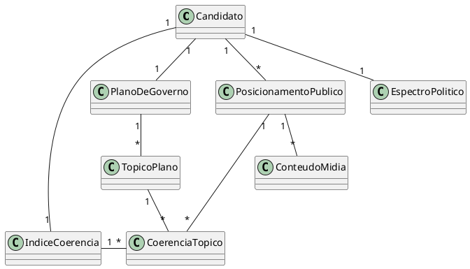

# Diagrama de Classes de Negócios

---
## Codificação do Diagrama

```plantuml
@startuml

class Candidato
class PlanoDeGoverno
class TopicoPlano
class PosicionamentoPublico
class ConteudoMidia
class IndiceCoerencia
class EspectroPolitico
class CoerenciaTopico

Candidato "1" -down- "1" PlanoDeGoverno
PlanoDeGoverno "1" -- "*" TopicoPlano

Candidato "1" -- "*" PosicionamentoPublico
PosicionamentoPublico "1" -- "*" ConteudoMidia

Candidato "1" -- "1" EspectroPolitico

Candidato "1" -- "1" IndiceCoerencia
IndiceCoerencia "1" - "*" CoerenciaTopico

TopicoPlano "1" -down- "*" CoerenciaTopico
PosicionamentoPublico "1" -- "*" CoerenciaTopico

@enduml
```
