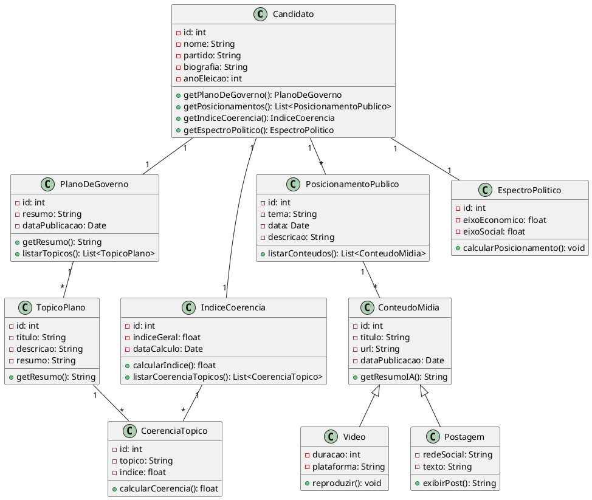

# Diagrama de Classe de Implementação
[
---

## Codificação do Diagrama

```plantuml
@startuml

class Candidato {
    -id: int
    -nome: String
    -partido: String
    -biografia: String
    -anoEleicao: int
    +getPlanoDeGoverno(): PlanoDeGoverno
    +getPosicionamentos(): List<PosicionamentoPublico>
    +getIndiceCoerencia(): IndiceCoerencia
    +getEspectroPolitico(): EspectroPolitico
}

class PlanoDeGoverno {
    -id: int
    -resumo: String
    -dataPublicacao: Date
    +getResumo(): String
    +listarTopicos(): List<TopicoPlano>
}

class TopicoPlano {
    -id: int
    -titulo: String
    -descricao: String
    -resumo: String
    +getResumo(): String
}

class PosicionamentoPublico {
    -id: int
    -tema: String
    -data: Date
    -descricao: String
    +listarConteudos(): List<ConteudoMidia>
}

class ConteudoMidia {
    -id: int
    -titulo: String
    -url: String
    -dataPublicacao: Date
    +getResumoIA(): String
}

class Video {
    -duracao: int
    -plataforma: String
    +reproduzir(): void
}

class Postagem {
    -redeSocial: String
    -texto: String
    +exibirPost(): String
}

class IndiceCoerencia {
    -id: int
    -indiceGeral: float
    -dataCalculo: Date
    +calcularIndice(): float
    +listarCoerenciaTopicos(): List<CoerenciaTopico>
}

class CoerenciaTopico {
    -id: int
    -topico: String
    -indice: float
    +calcularCoerencia(): float
}

class EspectroPolitico {
    -id: int
    -eixoEconomico: float
    -eixoSocial: float
    +calcularPosicionamento(): void
}

ConteudoMidia <|-- Video
ConteudoMidia <|-- Postagem

Candidato "1" -- "1" PlanoDeGoverno
PlanoDeGoverno "1" -- "*" TopicoPlano

Candidato "1" -- "*" PosicionamentoPublico
PosicionamentoPublico "1" -- "*" ConteudoMidia

Candidato "1" -- "1" EspectroPolitico

Candidato "1" -- "1" IndiceCoerencia
IndiceCoerencia "1" -- "*" CoerenciaTopico

TopicoPlano "1" -- "*" CoerenciaTopico
```
PosicionamentoPublico "1" --- "*" CoerenciaTopico

@enduml
