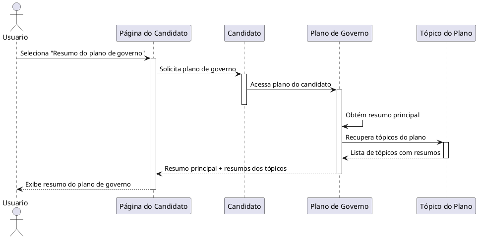

# Visualizar Resumo do Plano de Governo

---
## Descrição do Diagrama

O fluxo começa quando o usuário, na página do candidato, seleciona a seção “Resumo do plano de governo”. A interface então acessa o plano de governo do candidato, que fornece o resumo principal e os tópicos do plano com seus respectivos resumos. Em seguida, o sistema retorna essas informações para a página do candidato, que exibe ao usuário o resumo geral do plano e os principais tópicos discutidos, incluindo também os tópicos menos abordados.

---
## Codificação do Diagrama

