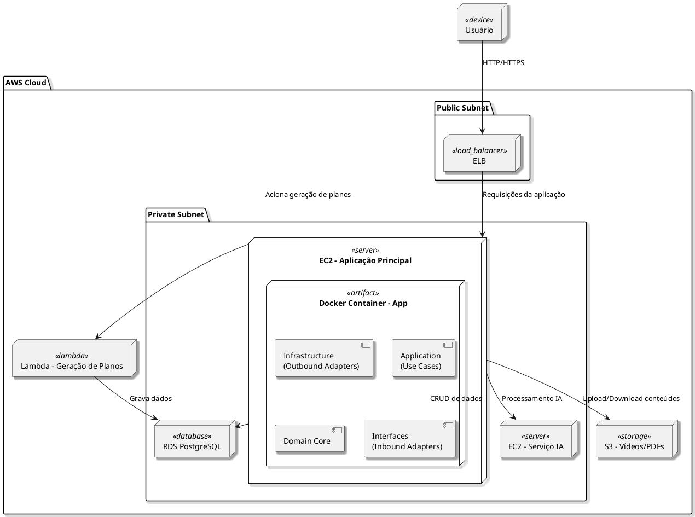

# Diagrama de Implantação

[](https://editor.plantuml.com/uml/XLHDRzD04BrRydyOvL8uH155NA8gQd1eYHI943VbWeGczYIiOk-QtNMAXF9Z48UUE7BXwZ_6x6w-rGOValNil7blldnjB6fRbqKScQMG5MeimNp5N3q8kG2hQpgyqPHPb8k2u4SS0KnKBVD4QKaQNhs9etKSnT55kzs6gQcRdreeu9SuaYedQ6rjBK333eovkiff9JBgzLmyZzxW-vzII0fLvo50XTaI5nnZPsyvXDC0S07ZUbQ83D9w9ia6umvnTEUfWoKOGXxX2IhVZTvwB_vdVON2_CiC2vGPwLulEAyFcBLOeQLdg8yk0tSmFKkUN08dNx4-R1wRNye1P2OgB8AevB9VLQoBgxToWWuYx88CLBRauYPAMXIkDIvYvV7XAeJWleivPZOK7qwUJ9MLaYGjj8Pohj7mA6IsrlHPllXGsvdhFFHph2nfyx9rDW3pkOIiK9BHt7b8qD3_K0DLidnEGzDvnw5a3Pm96Ou-bEUbhVUlwwUhdt9fHVEeODZVrdpOFoZvAMeoI66iZ5reIZ-EFCIPUBRHuemJVM9ijXm65gI96ymBPs2kD4AES3zEWcCW664vOsiRRablfeBDOvv9PJpTne6drH-sV06TlcRaVVCx9sKwuy5DWB2LCx9CkF3wzfjxKzJVMOiH9JTjpcrpoWYo0ZKV_3RwtMstUtv7kl3-xcxSSJzf73cBlmc3seK9VQk5uLoRFsHSShWVRiUvSTnWkD1T7dd5lJHOSdTT5uwSN6cxa4oc0rU4tAaxkkV4kZ2jtDvs1kf1kWCF2uz8y_VKTrEtBlGp7arqlTZNj_Br3P-aRGTs_BSQLxXbZwDhaZb_G_y1)

---
## Codificação do Diagrama

