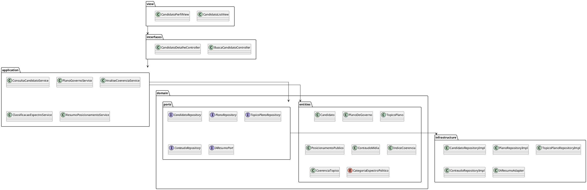

# Diagrama de Pacotes

---
## Diagrama de Pacotes

O diagrama de pacotes mostra a **organização do código por pacotes**, evidenciando **dependências entre eles**:

- **view** - contém as clsses referentes a Interface Gráfica do Usuário (GUI).
- **interfaces (Inbound Adapters)** – contém os controllers que recebem as requisições do usuário.  
- **application (Use Cases)** – implementa os casos de uso, orquestrando a lógica de negócio.  
- **domain.entities** – contém as entidades do domínio que representam o core da aplicação.  
- **domain.ports** – interfaces que definem contratos que serão implementados pela infraestrutura.  
- **infrastructure** – implementações técnicas de repositórios e integrações externas (adapters).
  

---

## Codificação do Diagrama

