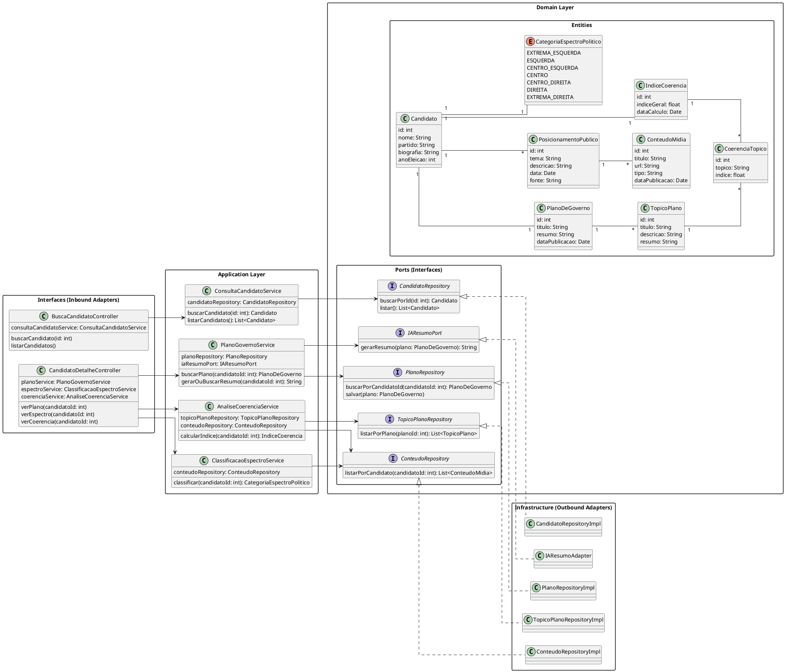

# Diagrama de Classe de Implementação

---
## Codificação do Diagrama

```plantuml

@startuml

skinparam packageStyle rectangle
skinparam linetype ortho
left to right direction

package "Interfaces (Inbound Adapters)" {

class BuscaCandidatoController {
 consultaCandidatoService: ConsultaCandidatoService

 buscarCandidato(id: int)
 listarCandidatos()
}

class CandidatoDetalheController {
 planoService: PlanoGovernoService
 espectroService: ClassificacaoEspectroService
 coerenciaService: AnaliseCoerenciaService

 verPlano(candidatoId: int)
 verEspectro(candidatoId: int)
 verCoerencia(candidatoId: int)
}

}

package "Application Layer" {

class ConsultaCandidatoService {
 candidatoRepository: CandidatoRepository

 buscarCandidato(id: int): Candidato
 listarCandidatos(): List<Candidato>
}

class PlanoGovernoService {
 planoRepository: PlanoRepository
 iaResumoPort: IAResumoPort

 buscarPlano(candidatoId: int): PlanoDeGoverno
 gerarOuBuscarResumo(candidatoId: int): String
}

class AnaliseCoerenciaService {
 topicoPlanoRepository: TopicoPlanoRepository
 conteudoRepository: ConteudoRepository

 calcularIndice(candidatoId: int): IndiceCoerencia
}

class ClassificacaoEspectroService {
 conteudoRepository: ConteudoRepository

 classificar(candidatoId: int): CategoriaEspectroPolitico
}

}

package "Domain Layer" {

package "Entities" {

class Candidato {
 id: int
 nome: String
 partido: String
 biografia: String
 anoEleicao: int
}

class PlanoDeGoverno {
 id: int
 titulo: String
 resumo: String
 dataPublicacao: Date
}

class TopicoPlano {
 id: int
 titulo: String
 descricao: String
 resumo: String
}

class PosicionamentoPublico {
 id: int
 tema: String
 descricao: String
 data: Date
 fonte: String
}

class ConteudoMidia {
 id: int
 titulo: String
 url: String
 tipo: String
 dataPublicacao: Date
}

class IndiceCoerencia {
 id: int
 indiceGeral: float
 dataCalculo: Date
}

class CoerenciaTopico {
 id: int
 topico: String
 indice: float
}

enum CategoriaEspectroPolitico {
 EXTREMA_ESQUERDA
 ESQUERDA
 CENTRO_ESQUERDA
 CENTRO
 CENTRO_DIREITA
 DIREITA
 EXTREMA_DIREITA
}

}

package "Ports (Interfaces)" {

interface CandidatoRepository {
 buscarPorId(id: int): Candidato
 listar(): List<Candidato>
}

interface PlanoRepository {
 buscarPorCandidatoId(candidatoId: int): PlanoDeGoverno
 salvar(plano: PlanoDeGoverno)
}

interface TopicoPlanoRepository {
 listarPorPlano(planoId: int): List<TopicoPlano>
}

interface ConteudoRepository {
 listarPorCandidato(candidatoId: int): List<ConteudoMidia>
}

interface IAResumoPort {
 gerarResumo(plano: PlanoDeGoverno): String
}

}
}

package "Infrastructure (Outbound Adapters)" {

class CandidatoRepositoryImpl
class PlanoRepositoryImpl
class TopicoPlanoRepositoryImpl
class ConteudoRepositoryImpl
class IAResumoAdapter

}

' Inbound → Application

BuscaCandidatoController --> ConsultaCandidatoService

CandidatoDetalheController --> PlanoGovernoService
CandidatoDetalheController --> ClassificacaoEspectroService
CandidatoDetalheController --> AnaliseCoerenciaService

' Application → Ports

ConsultaCandidatoService --> CandidatoRepository

PlanoGovernoService --> PlanoRepository
PlanoGovernoService --> IAResumoPort

AnaliseCoerenciaService --> TopicoPlanoRepository
AnaliseCoerenciaService --> ConteudoRepository

ClassificacaoEspectroService --> ConteudoRepository

' Ports → Infrastructure

CandidatoRepository <|.. CandidatoRepositoryImpl
PlanoRepository <|.. PlanoRepositoryImpl
TopicoPlanoRepository <|.. TopicoPlanoRepositoryImpl
ConteudoRepository <|.. ConteudoRepositoryImpl
IAResumoPort <|.. IAResumoAdapter

' Domain relationships

Candidato "1" -- "1" PlanoDeGoverno
Candidato "1" -- "1" IndiceCoerencia
Candidato "1" -- "1" CategoriaEspectroPolitico

PlanoDeGoverno "1" -- "*" TopicoPlano

Candidato "1" -- "*" PosicionamentoPublico
PosicionamentoPublico "1" -- "*" ConteudoMidia

IndiceCoerencia "1" -- "*" CoerenciaTopico
TopicoPlano "1" -- "*" CoerenciaTopico

@enduml
```
