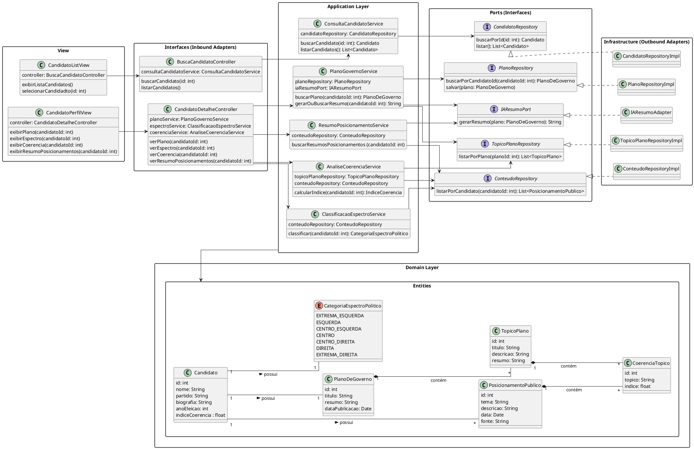

# Diagrama de Classe de Implementação

[![](https://img.plantuml.biz/plantuml/svg/dLXDRXit5DuRy1q8RI87S81kXS288Ws20T9QbTsYku2QUPA9SCW1oN5hjDxs0Br5pj6Rz2GbEJyaPyYH42E0bVVxlLy-wuDKMAYcejTNrrVoAs4r5hX2DIw-uXCyg1SAI42XC3jHy2KeOQ1UQa1Sg2T-VKNXg93YI93Jaq8bCKg4CsEsCuOMlnBuVO7-DBI2OYdH1hEIb5ZnpqGgmpLCrFqKd2d1AGMnGXyRMU11UZDmdBJx17-G0n76ejEGonid8852eR5XqV5BnPUaN272L2VsQZ1Q427E7OWZeND81z4jA4oVu1AiEuePNnQzPXv0SMAPh7LInGMI6mu2M47mUT4zoARYEow9JKa5p6GheMRJyXhKD6TAvmGN8D4oPmVUi1AjIrnhghm9YfsgeSsaJg5ig5Un1n3Ff02Tq0J7LkXWR8g1vLUHcWOGOGUyHbflKYUBfpOb6J3O0dtYpo2OSu-WguU3QYoJ8obmWNaMScsCNLK6XJN36YPiHWmRcdQMxWlDdEq6pP_l0IrmSUKZLL_NDTLXcWb7d_4BY72i4oLhAzqJzr1htugB5szg776slfv6jDGhPER__K2w2seVAQShkWzh5nAq2C5zseHQeNpj_kVXJTIjixU5phMMFu70uhwnez4L9ARte0HXfo26HElOE1IlIS5tusWUO-HszXGqPLYG2St6Ls1QD1IBN4Ci80QrvGommfcRcOz-2roCPB0bOZ0sMC692u9xDpjEYTBX1u1Y8_0zUD1G-jQY74qLkd2ijhp299oeWPSnfGC06Nz0BTnkElGdnYjmRQEVSw58oJtAWV2Jm4U2FPhkYuo2pYZlpP2mc6Y5ZfHZDHsceQT7E3JaXlf-XSsFHz3WyQuvqBOfLcYh2nVOzxhsdF4IP25Q_4c7FlAWI2s8YG-ey1aF9e8UDpgQxeXw6xBO1ZJsOucUrJRrOSA1DLMwiwt5xBV7VVRZ-alsyFClsNwxDYJtSPFzzBY__pAXEDOstsVve-6uJxtDWVBQ__FQqwn0UmBqvq3_-9EU4blo5dEtDBd8oza5drxhpiTekuNsDsu8BzhE4jDdxTO-2sFspSHrTBrQ02ry3Q1z6AmzvzQ6v2bFWvgkdD2iUnyZKLdpqLQVElBVC-l2la_TknHFmwZNnyVXKM2fH5EeHW1QtZTgxaACD4XUrJJOD75MDFU-m3I5FhUFkuCr1F86zIVjVt__WxoZnp2Jz-pjxTtirJfpUXhLwB5vHcV-yZoZdBn2p-ZDl9vjylmhqIJGxWYRWTI1Q6E9tuAnesr8bo-Q4WoFjPHKuaYwlaeTN3DASohnisRsGagfpLqntwiplcnDETiLRmePpdNGqzwEUl_NktVfcHulIYiTdU3uOhNoCtCVMPejeCGc27QVbOniXJUeEz44KDlNyedKCaW0Mlomq2cqlz9lzGffxx8Xw2wXEZghvkNVBXB7ZA_MfTpPDDflEtN_obhPk_VVRvNHyHc-mlYSyPJYK2vKDZcstw_i-mm7sHs-A39DclvMAFQ5JR1R8j_EQC_sy1uywwi-zeVkRLDhI-uUDveVW9LDHVy7)](https://editor.plantuml.com/uml/dLXDRXit5DuRy1q8RI87S81kXS288Ws20T9QbTsYku2QUPA9SCW1oN5hjDxs0Br5pj6Rz2GbEJyaPyYH42E0bVVxlLy-wuDKMAYcejTNrrVoAs4r5hX2DIw-uXCyg1SAI42XC3jHy2KeOQ1UQa1Sg2T-VKNXg93YI93Jaq8bCKg4CsEsCuOMlnBuVO7-DBI2OYdH1hEIb5ZnpqGgmpLCrFqKd2d1AGMnGXyRMU11UZDmdBJx17-G0n76ejEGonid8852eR5XqV5BnPUaN272L2VsQZ1Q427E7OWZeND81z4jA4oVu1AiEuePNnQzPXv0SMAPh7LInGMI6mu2M47mUT4zoARYEow9JKa5p6GheMRJyXhKD6TAvmGN8D4oPmVUi1AjIrnhghm9YfsgeSsaJg5ig5Un1n3Ff02Tq0J7LkXWR8g1vLUHcWOGOGUyHbflKYUBfpOb6J3O0dtYpo2OSu-WguU3QYoJ8obmWNaMScsCNLK6XJN36YPiHWmRcdQMxWlDdEq6pP_l0IrmSUKZLL_NDTLXcWb7d_4BY72i4oLhAzqJzr1htugB5szg776slfv6jDGhPER__K2w2seVAQShkWzh5nAq2C5zseHQeNpj_kVXJTIjixU5phMMFu70uhwnez4L9ARte0HXfo26HElOE1IlIS5tusWUO-HszXGqPLYG2St6Ls1QD1IBN4Ci80QrvGommfcRcOz-2roCPB0bOZ0sMC692u9xDpjEYTBX1u1Y8_0zUD1G-jQY74qLkd2ijhp299oeWPSnfGC06Nz0BTnkElGdnYjmRQEVSw58oJtAWV2Jm4U2FPhkYuo2pYZlpP2mc6Y5ZfHZDHsceQT7E3JaXlf-XSsFHz3WyQuvqBOfLcYh2nVOzxhsdF4IP25Q_4c7FlAWI2s8YG-ey1aF9e8UDpgQxeXw6xBO1ZJsOucUrJRrOSA1DLMwiwt5xBV7VVRZ-alsyFClsNwxDYJtSPFzzBY__pAXEDOstsVve-6uJxtDWVBQ__FQqwn0UmBqvq3_-9EU4blo5dEtDBd8oza5drxhpiTekuNsDsu8BzhE4jDdxTO-2sFspSHrTBrQ02ry3Q1z6AmzvzQ6v2bFWvgkdD2iUnyZKLdpqLQVElBVC-l2la_TknHFmwZNnyVXKM2fH5EeHW1QtZTgxaACD4XUrJJOD75MDFU-m3I5FhUFkuCr1F86zIVjVt__WxoZnp2Jz-pjxTtirJfpUXhLwB5vHcV-yZoZdBn2p-ZDl9vjylmhqIJGxWYRWTI1Q6E9tuAnesr8bo-Q4WoFjPHKuaYwlaeTN3DASohnisRsGagfpLqntwiplcnDETiLRmePpdNGqzwEUl_NktVfcHulIYiTdU3uOhNoCtCVMPejeCGc27QVbOniXJUeEz44KDlNyedKCaW0Mlomq2cqlz9lzGffxx8Xw2wXEZghvkNVBXB7ZA_MfTpPDDflEtN_obhPk_VVRvNHyHc-mlYSyPJYK2vKDZcstw_i-mm7sHs-A39DclvMAFQ5JR1R8j_EQC_sy1uywwi-zeVkRLDhI-uUDveVW9LDHVy7)

---

### Descrição 

O sistema é organizado em camadas:

#### 1. Interfaces (Inbound Adapters)

  - Controllers expõem endpoints para busca de candidatos e detalhes de seus planos, espectro político e coerência.

  - Exemplo: BuscaCandidatoController delega chamadas para ConsultaCandidatoService.

#### 2. Application Layer

  - Contém services que implementam a lógica de aplicação, coordenando a comunicação entre os repositórios, adaptadores e entidades de domínio.

  - Exemplo: PlanoGovernoService busca planos e gera resumos via IA (IAResumoPort).

#### 3. Domain Layer

  - Define as entidades centrais (Candidato, PlanoDeGoverno, TopicoPlano, etc.) e enums (CategoriaEspectroPolitico), representando o núcleo do negócio.

  - As entidades mantêm relacionamentos importantes, como cada candidato possuindo um plano de governo, índice de coerência e categoria política.

#### 4. Ports (Interfaces)

  - Interfaces que abstraem dependências externas, como repositórios de dados e adaptadores de IA.

  - Permitem que a Application Layer não dependa diretamente da implementação de infraestrutura.

#### 5. Infrastructure (Outbound Adapters)

  - Implementações concretas das interfaces de portas (RepositoryImpl, IAResumoAdapter) que interagem com bancos de dados ou serviços externos.

#### 6. View

 - Classes que representam a interface gráfica do usuário

---

## Codificação do Diagrama

