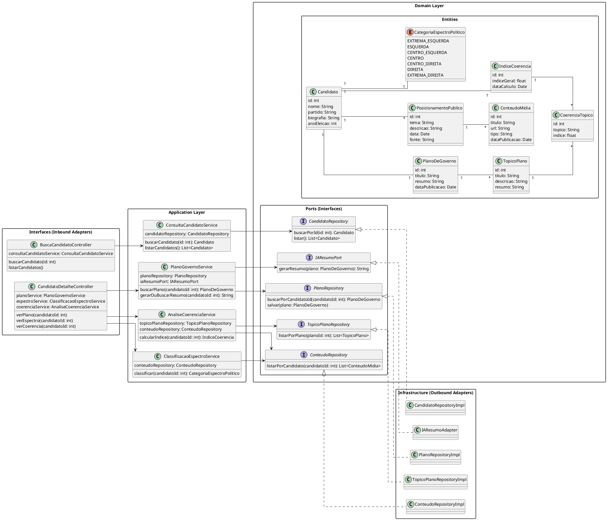

# Diagrama de Classe de Implementação
[![](https://img.plantuml.biz/plantuml/svg/ZLVDRXit4BxpAGXTB1T8W5w588WgBO85abgLNI2tWDuToKGeSa5o3HYjhts0FcAVf2HtbpyhSkEJjJF3RxxvuN3yIMaYTNzX2AaVb7T4aWlkIFE3dE5Ulp304XfD-9b1PC0e1_tI0HPIFmd4uAIn5bZIyvF6BRL7gE08ZK1uLNCDyaGQK7XTyqVHynPlMz8PgRfTuRyGQXXH2l_MguRi26zfIxJO2QwbO0oaiS2DuAfdEgZlGJxJ1ZPuLz0WX1yjeFIADMqtc79zYqmCDdIlKUjRz3hHyD8zQCAU82NICSA3yuFz-YoUGNeXmg0wamCPKRIuz4GRqX1HfLeR6aZW3INUVik98MWSfmeJaN7aNAwRYMJjOpAw2RkWze0PlGd_DQhPjkkOuMihYR-G5v1HdKePTtMQP4VeXA9Qo9TDo6WGBbGdiiyLQeE_6Da7B_eOAfUfXYzPpEUG2X2cv0YgluY3QUaDhhVXo_Cif7q4syFe5k4pI2BlUjVCSW3A7RlNal9pu5wekUMlHKSRSPX7yP0JkvkYeM_J0bp9a2qLQtf6P6suDP3ZE6WyfUYAB3JqU5lVoC43oHo17T5m5fAIoST1CAfDrFDstOiBeN6dUat5jJa1AkxVoP6bEdOTmbnSm9V5J46fQIk2u96AioGdIeB89BvYOBYB0IBjGzyIYHT3fcSHh7GD4huDBNBe7zcGsWtUcmm4uAZaYwWjg4OEn0gE0bTJZCRSSd81hiNWUWOE5x88RJcFJF79LldQorJyhxIbP95wBrduqBHxSsvcpPeueKxtsTnC0tvYWkW1RUUkm1MK1ndodV9rea1gW9vG3GJm_b9kN8jLVNiuLb-ttwlxF_wiZlkjaVXVk-htX-FTzxd0A_RriQeVZDp_cD0cmUncs27ctjtf3HvUN3fzvuQp9JbEFI7hTcao5-PnW9_DfmHw5sxyMoQh8kpPU7JZVAwzJRrcPwFrFR0sleTvxh22HnT9T7OMo_K8Io33KvO9PaXIV0rcuF6hOs7TEpA-7_cGuslscXIzvYT9b9Pzeti9U7tNw_BQbMc0-jAnU9PbDTaSH_hhR4NAATgHaElP6pnjX__zyo-EDX24YglXktSV5pR0XLNE7injRpyvihZA_UHiSQsxYODrmRjRQ_YNDYr79RTLvLOW7sfaMB9BTv_IKc8jy-l7qedS1h2uIPGEtGpvSPbAMpqgUNH9F_pz_dsnpUT3mXddkZe_Kvnv-IfaHiR09dyvaY7W3AykoWqUbnq9p3MCUgATYWB7grzN9dNkpso4PctcMrxMgBo9eTcsCntwPHMd9SVFM6It3vJVIQ9ZoHn5QFxq9vR9KnuNSSaCVGBUcd-C_mS0)](https://editor.plantuml.com/uml/ZLVDRXit4BxpAGXTB1T8W5w588WgBO85abgLNI2tWDuToKGeSa5o3HYjhts0FcAVf2HtbpyhSkEJjJF3RxxvuN3yIMaYTNzX2AaVb7T4aWlkIFE3dE5Ulp304XfD-9b1PC0e1_tI0HPIFmd4uAIn5bZIyvF6BRL7gE08ZK1uLNCDyaGQK7XTyqVHynPlMz8PgRfTuRyGQXXH2l_MguRi26zfIxJO2QwbO0oaiS2DuAfdEgZlGJxJ1ZPuLz0WX1yjeFIADMqtc79zYqmCDdIlKUjRz3hHyD8zQCAU82NICSA3yuFz-YoUGNeXmg0wamCPKRIuz4GRqX1HfLeR6aZW3INUVik98MWSfmeJaN7aNAwRYMJjOpAw2RkWze0PlGd_DQhPjkkOuMihYR-G5v1HdKePTtMQP4VeXA9Qo9TDo6WGBbGdiiyLQeE_6Da7B_eOAfUfXYzPpEUG2X2cv0YgluY3QUaDhhVXo_Cif7q4syFe5k4pI2BlUjVCSW3A7RlNal9pu5wekUMlHKSRSPX7yP0JkvkYeM_J0bp9a2qLQtf6P6suDP3ZE6WyfUYAB3JqU5lVoC43oHo17T5m5fAIoST1CAfDrFDstOiBeN6dUat5jJa1AkxVoP6bEdOTmbnSm9V5J46fQIk2u96AioGdIeB89BvYOBYB0IBjGzyIYHT3fcSHh7GD4huDBNBe7zcGsWtUcmm4uAZaYwWjg4OEn0gE0bTJZCRSSd81hiNWUWOE5x88RJcFJF79LldQorJyhxIbP95wBrduqBHxSsvcpPeueKxtsTnC0tvYWkW1RUUkm1MK1ndodV9rea1gW9vG3GJm_b9kN8jLVNiuLb-ttwlxF_wiZlkjaVXVk-htX-FTzxd0A_RriQeVZDp_cD0cmUncs27ctjtf3HvUN3fzvuQp9JbEFI7hTcao5-PnW9_DfmHw5sxyMoQh8kpPU7JZVAwzJRrcPwFrFR0sleTvxh22HnT9T7OMo_K8Io33KvO9PaXIV0rcuF6hOs7TEpA-7_cGuslscXIzvYT9b9Pzeti9U7tNw_BQbMc0-jAnU9PbDTaSH_hhR4NAATgHaElP6pnjX__zyo-EDX24YglXktSV5pR0XLNE7injRpyvihZA_UHiSQsxYODrmRjRQ_YNDYr79RTLvLOW7sfaMB9BTv_IKc8jy-l7qedS1h2uIPGEtGpvSPbAMpqgUNH9F_pz_dsnpUT3mXddkZe_Kvnv-IfaHiR09dyvaY7W3AykoWqUbnq9p3MCUgATYWB7grzN9dNkpso4PctcMrxMgBo9eTcsCntwPHMd9SVFM6It3vJVIQ9ZoHn5QFxq9vR9KnuNSSaCVGBUcd-C_mS0)

---

### Descrição 

O sistema é organizado em camadas:

1. Interfaces (Inbound Adapters)

  - Controllers expõem endpoints para busca de candidatos e detalhes de seus planos, espectro político e coerência.

  - Exemplo: BuscaCandidatoController delega chamadas para ConsultaCandidatoService.

2. Application Layer

  - Contém services que implementam a lógica de aplicação, coordenando a comunicação entre os repositórios, adaptadores e entidades de domínio.

  - Exemplo: PlanoGovernoService busca planos e gera resumos via IA (IAResumoPort).

3. Domain Layer

  - Define as entidades centrais (Candidato, PlanoDeGoverno, TopicoPlano, etc.) e enums (CategoriaEspectroPolitico), representando o núcleo do negócio.

  - As entidades mantêm relacionamentos importantes, como cada candidato possuindo um plano de governo, índice de coerência e categoria política.

4. Ports (Interfaces)

  - Interfaces que abstraem dependências externas, como repositórios de dados e adaptadores de IA.

  - Permitem que a Application Layer não dependa diretamente da implementação de infraestrutura.

5. Infrastructure (Outbound Adapters)

  - Implementações concretas das interfaces de portas (RepositoryImpl, IAResumoAdapter) que interagem com bancos de dados ou serviços externos.

## Codificação do Diagrama

