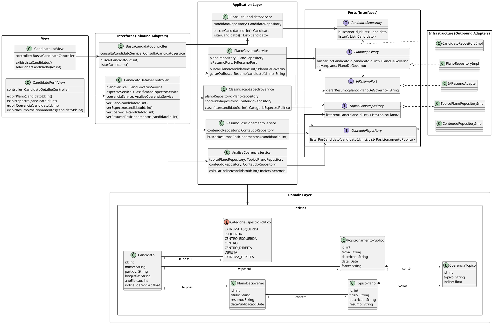

# Diagrama de Classe de Implementação

[![](https://img.plantuml.biz/plantuml/svg/dLXDRXit5DuRy1q8RI87S81kXS288WsA0T9QbTsYku2QUPA9SCW1oN5hjDxs0Br5pj6Rz2GbEJyaPyYHKYE0bVVxlLy-wuDKMAYcejTNrrVo2s4r5hX2DIw-u1Cyg1SAI42XC3jHy2KeOQ1UQa1Sg2T-VKNXg93YI93Jaq8bCKg4CsEsCuOMln3uRO7-CBI2OYdH1hEIb5ZnJqGgmpLCrFqKd2d1AGMnGXyRMU11UZDmdBJx1B-J0n76ejEGonid8852eR5XqV5BnPUaN272L2VsQZ1Q427E7OWZeND81z4jA4oVu1AiEuePNnQzPXv0SMAPh7LInGMI6mu2M47mUT4zoARYEow9JKa5p6GheMRJyXhKD6TAvmGN8D4oPmVUi1AjIrnhghm9YfsgeSsaJg5ig5Un1n3Ff02Tq0J7LkXWR8g1vLUHcWOGOGUyHbflKYUBfpOb6J3O0dtFdq4mvnv1Lmy7rLWcHrBW0lCivDeOkweC2ck6DKpOZ1WsDEqitHUQETiDcZ_V0rhWuif7ghwkQwh3D1EEFk4N4E5O9qhMLhedxg7MlXKNBzxKEE9iVJsDQAbNoCp_-u5q5zG-KavNT1_MBYHe4OBxj0crGldQ_S_3cwXRPsyBdMijVmA1nNrZHwChI4plGGd2Ja4CYTQnSIXUauBlnj4yniZjx2beoh0W4vgDhy2qQ2WMkOPOG0ngonbWXJCtCn-N5k1Rm0xkH0pf1YiuSK5mZsJ7AL4wGm7cs9G4xNmX7ZHqHsjHZWOFNJXvMrvX4WxTmCkOqW60ZB-n5cutGFeJunMupj8llb2av1xbGFX9u2F17arN8wEWCyfxCoIiDrgX8-LOJUTjQFiH3WsveRvVOVFZ4JHul6iEjEsR5ThgmWNslSO-Pxm4MOWMVzAXZpmeKWjYuWCgVCQ3YQ37ZOwcEwBUXYos0OtzMA9djKrzc71WJPNkR6in-_Lnd_sm_fmz_FHpjj-k3Sbzt6G_FkxlFqyeZhNDzrd-Q3ZkKszpeBps_xpsD5lINWdznT3V1wIdnDu1YxdRgrpavUmRaDxypiTefuJsDsu8BrhW4jDdxTOkhZ7xPk8wke4jW1Q-1j2-7TQUSsj3yfIdGKrNJcZMFQ6HgApvQAjF7VbFddLXdx3kwOgdOTJhu_lnAB1KeYbK8m0jxnirTqH66YIlQXficZWhcdjVO9f2dzl7tS4Q0dc3-glttx_-HjvTP9Z9a_Vszcxsi9svJergz1uzepD_d9vHJXwgP_HcNiysUVuXQH9eTuJDGEg6jB74pyNONJUaonTD2ORtN4egSKTTNwLkiXcbEPNuMJDxH4MZFQiHSpHtz_nVdV6vR1gWVHHCwSDD44o1jzNU__dkNNeBZ5UhbOxEV7mLM_cPJH5PiosWnEu8jgMLZEoHDwWxwWHGEmdoYTGoI01QVBVGARI_qg_x2cdliY7eBg4wEiJcvTyk4kUFhzQbtDaqscyxTVykMzbB-P-lbT7n6Rx2-03obE9GBbGsERPVskpx30VP7RvzCasQ_gefzYrGi8qYN_bep_PK7pphlmDYVptVDhMsv2vue_a1MDbKz3y0)](https://editor.plantuml.com/uml/dLXDRXit5DuRy1q8RI87S81kXS288WsA0T9QbTsYku2QUPA9SCW1oN5hjDxs0Br5pj6Rz2GbEJyaPyYHKYE0bVVxlLy-wuDKMAYcejTNrrVo2s4r5hX2DIw-u1Cyg1SAI42XC3jHy2KeOQ1UQa1Sg2T-VKNXg93YI93Jaq8bCKg4CsEsCuOMln3uRO7-CBI2OYdH1hEIb5ZnJqGgmpLCrFqKd2d1AGMnGXyRMU11UZDmdBJx1B-J0n76ejEGonid8852eR5XqV5BnPUaN272L2VsQZ1Q427E7OWZeND81z4jA4oVu1AiEuePNnQzPXv0SMAPh7LInGMI6mu2M47mUT4zoARYEow9JKa5p6GheMRJyXhKD6TAvmGN8D4oPmVUi1AjIrnhghm9YfsgeSsaJg5ig5Un1n3Ff02Tq0J7LkXWR8g1vLUHcWOGOGUyHbflKYUBfpOb6J3O0dtFdq4mvnv1Lmy7rLWcHrBW0lCivDeOkweC2ck6DKpOZ1WsDEqitHUQETiDcZ_V0rhWuif7ghwkQwh3D1EEFk4N4E5O9qhMLhedxg7MlXKNBzxKEE9iVJsDQAbNoCp_-u5q5zG-KavNT1_MBYHe4OBxj0crGldQ_S_3cwXRPsyBdMijVmA1nNrZHwChI4plGGd2Ja4CYTQnSIXUauBlnj4yniZjx2beoh0W4vgDhy2qQ2WMkOPOG0ngonbWXJCtCn-N5k1Rm0xkH0pf1YiuSK5mZsJ7AL4wGm7cs9G4xNmX7ZHqHsjHZWOFNJXvMrvX4WxTmCkOqW60ZB-n5cutGFeJunMupj8llb2av1xbGFX9u2F17arN8wEWCyfxCoIiDrgX8-LOJUTjQFiH3WsveRvVOVFZ4JHul6iEjEsR5ThgmWNslSO-Pxm4MOWMVzAXZpmeKWjYuWCgVCQ3YQ37ZOwcEwBUXYos0OtzMA9djKrzc71WJPNkR6in-_Lnd_sm_fmz_FHpjj-k3Sbzt6G_FkxlFqyeZhNDzrd-Q3ZkKszpeBps_xpsD5lINWdznT3V1wIdnDu1YxdRgrpavUmRaDxypiTefuJsDsu8BrhW4jDdxTOkhZ7xPk8wke4jW1Q-1j2-7TQUSsj3yfIdGKrNJcZMFQ6HgApvQAjF7VbFddLXdx3kwOgdOTJhu_lnAB1KeYbK8m0jxnirTqH66YIlQXficZWhcdjVO9f2dzl7tS4Q0dc3-glttx_-HjvTP9Z9a_Vszcxsi9svJergz1uzepD_d9vHJXwgP_HcNiysUVuXQH9eTuJDGEg6jB74pyNONJUaonTD2ORtN4egSKTTNwLkiXcbEPNuMJDxH4MZFQiHSpHtz_nVdV6vR1gWVHHCwSDD44o1jzNU__dkNNeBZ5UhbOxEV7mLM_cPJH5PiosWnEu8jgMLZEoHDwWxwWHGEmdoYTGoI01QVBVGARI_qg_x2cdliY7eBg4wEiJcvTyk4kUFhzQbtDaqscyxTVykMzbB-P-lbT7n6Rx2-03obE9GBbGsERPVskpx30VP7RvzCasQ_gefzYrGi8qYN_bep_PK7pphlmDYVptVDhMsv2vue_a1MDbKz3y0)

---
### Descrição 

O sistema é organizado em camadas:

#### 1. Interfaces (Inbound Adapters)

  - Controllers expõem endpoints para busca de candidatos e detalhes de seus planos, espectro político e coerência.

  - Exemplo: BuscaCandidatoController delega chamadas para ConsultaCandidatoService.

#### 2. Application Layer

  - Contém services que implementam a lógica de aplicação, coordenando a comunicação entre os repositórios, adaptadores e entidades de domínio.

  - Exemplo: PlanoGovernoService busca planos e gera resumos via IA (IAResumoPort).

#### 3. Domain Layer

  - Define as entidades centrais (Candidato, PlanoDeGoverno, TopicoPlano, etc.) e enums (CategoriaEspectroPolitico), representando o núcleo do negócio.

  - As entidades mantêm relacionamentos importantes, como cada candidato possuindo um plano de governo, índice de coerência e categoria política.

#### 4. Ports (Interfaces)

  - Interfaces que abstraem dependências externas, como repositórios de dados e adaptadores de IA.

  - Permitem que a Application Layer não dependa diretamente da implementação de infraestrutura.

#### 5. Infrastructure (Outbound Adapters)

  - Implementações concretas das interfaces de portas (RepositoryImpl, IAResumoAdapter) que interagem com bancos de dados ou serviços externos.

#### 6. View

 - Classes que representam a interface gráfica do usuário

---

## Codificação do Diagrama

