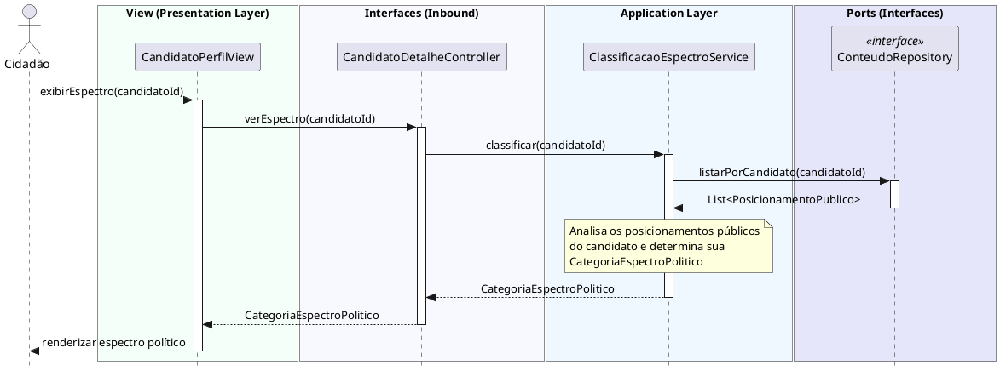

# Visualizar Espectro Político

---
## Codificação do Diagrama

```plantuml
@startuml
skinparam style strictuml
skinparam sequenceMessageAlign center
skinparam ParticipantPadding 40

actor "Cidadão" as User

box "View (Presentation Layer)" #MintCream
participant "CandidatoPerfilView" as View
end box

box "Interfaces (Inbound)" #GhostWhite
participant "CandidatoDetalheController" as Ctrl
end box

box "Application Layer" #AliceBlue
participant "ClassificacaoEspectroService" as Service
end box

box "Ports (Interfaces)" #Lavender
participant "ConteudoRepository" as Repo <<interface>>
end box

User -> View : exibirEspectro(candidatoId)
activate View

View -> Ctrl : verEspectro(candidatoId)
activate Ctrl

Ctrl -> Service : classificar(candidatoId)
activate Service

Service -> Repo : listarPorCandidato(candidatoId)
activate Repo

Repo --> Service : List<PosicionamentoPublico>
deactivate Repo

note over Service
Analisa os posicionamentos públicos
do candidato e determina sua
CategoriaEspectroPolitico
end note

Service --> Ctrl : CategoriaEspectroPolitico
deactivate Service

Ctrl --> View : CategoriaEspectroPolitico
deactivate Ctrl

View --> User : renderizar espectro político
deactivate View

@enduml
```
