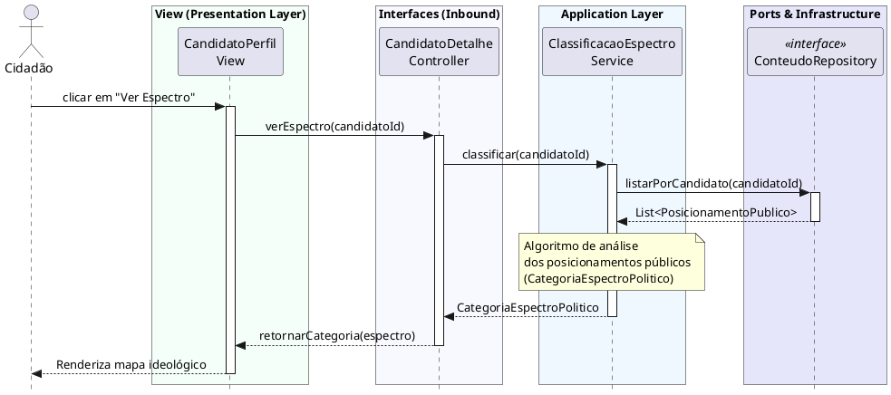

# Visualizar Espectro Político
[](https://editor.plantuml.com/uml/VLH1hjem4Dr7oXr6VAc2nRy0GkZJjAgG-5BKgks6pU0CODNnfBP3IszJzGZTTSl5EZO4oASqYyYE_TwRUM-K9n_GXROsUUQ_QDkWmnfys1kIjzFgveY-jcGLFPFtkA6PqHiBYcmWbsTvXYgmWq6XAwmEltW0wE6ZFvwj-3iCFcdw1iFIaHSC1iqM5hWdDnh0mxEseN24TPw1F28OjD8DsY2CQ2iX3LoIMskpj94eqST5df6jG0JEElDOqHeLUHZExOfRMqM9TrlsuVDM1_gVnXiAQBQqj0NRuDWOSacg2CxSIisQncXrrOleY2-ANflsdp86lTThWIZajxuX9HfB-u7SJa19wBI-rIhP1G-lO6xN3YMWLW9oWdbOu4xkHgDlzQG9QYj-JmrxBVdiaqRSmcIYEwEcqvvSJ0qUfybU68EABJgWMYAKWwxiGOfSxp3GAOWyImX1HhS4kIFNtHwgpk5vDRf27dtDiuGGvAdz9DjvvUw1prxbMOSJYjJT68oEyoskdREzHnC1UPPWZxqI5a8nASKv9G5ZBMFBPRiIErWCg-W5GPvPbWrBrvVAPcR3JeUQeI90U_WfPSddYZqqFMBP7_uaRfzdmq9e8n0x_qesMdBbqJ6fgDHh-sBwNMYlv2lhZjPVydOaWsBHdOc6T68QzIYww8wX2pxDpLZSYDEeVo3Ks23eYjWSVczULj3Dp9DSJt-Qlm00)

---
## Codificação do Diagrama

