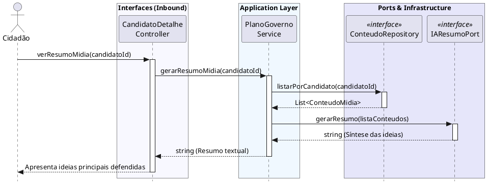

# Consultar Resumos de Interação na Mídia

[](https://editor.plantuml.com/uml/TLJDQjj04BuBz0w33Qrpo0iOOwAw40HE20cbbrmcksDxwNf7sLsP-6qAFVSf_6ATNLkk52Sw28cTxsU-6UacHFIntTgo2B-CQz3Z5aBSMvAxD-hYY5vRSehkA0HSKsNDse4Y5ycNHLcWYknXj30QzU4FZm03_0Z7inT-Wr6TAbUeAC2aTY_SEdqrWl7jXaFykJ6HoWBa4h5eb6dGHM53fuKmydUAQ3Vqx1RiecThoMU5HVHYafm6qJXBLKrZZS9esC4IzwbsB7uLVRFjHp8F5XtVyewyusVtH7udjPd_z7mfyS0-1lW2jLjvbBnQoSiBPhp4dTIclY-x4U_KQdwaXeEHkFPP8xt2R6QwVERp3x1rzKYXtNBIpQYwUe_fMKp1m_KynmDJaCQEw3kZ3KvKbsgjh_BWp0uZdR8iYwzmpv6cCZsfO-0k193vWpWFhO4qni1m-9ryA7OhzblP6sf11DQoBWYQG5aCWK9PP1_YfsEQmfeyVceAUgxE4oYB3Yr4ERCfM9EMM38vByfdpIL0MMJOzS38KYXctMIo5ObIqplWG5nQ7ZGmoJOwZj2NhQkoaFAXPFgyt1ecJuU_0Wa4MkPfD1bCs9vsGlUK_m-qOpZgGwItsA8TWdl17UCNUDwBALID5raNyQGAZT2bJJD1nhQYd60Oi1sNuqQEvBVm3m00)

---
## Codificação do Diagrama

