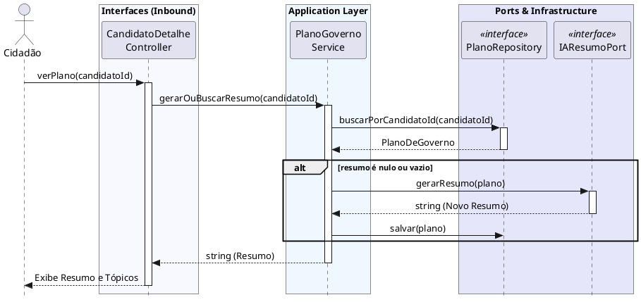

# Visualizar Resumo de Plano de Governo

[](https://editor.plantuml.com/uml/TLDBRjim4DqBq1q6Db3OYrp028meJX48IDeWRT5DDcDgOXEbEGf92N6lqrNNFO8lrX7rYHmxMWYIEEypxq5NFg0BrSwaYV-bROaET-33tf3SdLOdH_HIaLLqJzxZXZAZDnOKsK0kJT84LM07avKki3ZyuGcWXn--FLlpAqpoPl8P5NcOvNRDbItc4vZURjc7driTA4r0BX4BMkaIRH0sj8KG1hwXW6PBJtR5DZWsXbnKM0Kd9iaM81g3L5QMHYiCcYtSuRwPdOfVHTUcEYVpOD3oBTVaB3_PR-HgcOtytVEfn0ExuE4JvFRPeUHLILvECDCxh6MssVkyp2ELxBLajOy2pIjSNke-dENo333F7ibNEsv48ohFtcD6_fhKuM8Piu45o5PHUARwCFDY7llIDGRg8aoJE2wmRcL1RiYX-rfTLrwXQnryH3Bab2OzNgZYSWjOHm8nlte3VqJKGD8a0Y-EpCGTRgXhAKqAUeSH4XF0HPjm-0ksCWnSGOs_DRUXZgn9Wjs2tM9bmpzlvmRcF6i_oFInc-OFiHkOVU6QeMNei2DVFVeq4O-cHZTeIdb7oRsLr-iC4YFwKUPjTmABtI_WywjUK-SB2BuV_fLQiJ-2jxrVYRRywFy1)

---
## Codificação do Diagrama

