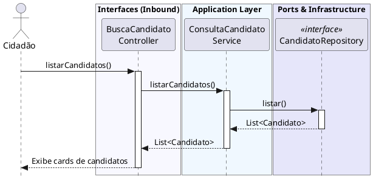

# Buscar Candidatos

---
## Codificação De Diagrama

```plantuml
@startuml
skinparam style strictuml
skinparam sequenceMessageAlign center

actor "Cidadão" as User

box "Interfaces (Inbound)" #GhostWhite
    participant "BuscaCandidato\nController" as Ctrl
end box

box "Application Layer" #AliceBlue
    participant "ConsultaCandidato\nService" as Service
end box

box "Ports & Infrastructure" #Lavender
    participant "CandidatoRepository" as Repo <<interface>>
end box

User -> Ctrl : listarCandidatos()
activate Ctrl

Ctrl -> Service : listarCandidatos()
activate Service

Service -> Repo : listar()
activate Repo
Repo --> Service : List<Candidato>
deactivate Repo

Service --> Ctrl : List<Candidato>
deactivate Service

Ctrl --> User : Exibe cards de candidatos
deactivate Ctrl
@enduml
```
