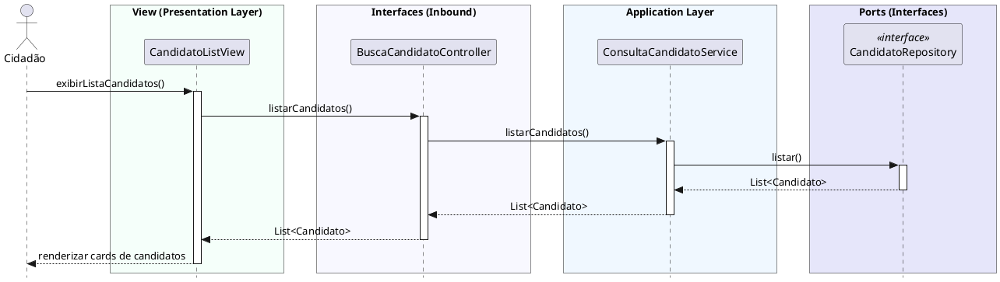

# Buscar Candidatos

---
## Codificação De Diagrama

```plantuml
@startuml
skinparam style strictuml
skinparam sequenceMessageAlign center
skinparam ParticipantPadding 40
skinparam ParticipantMinWidth 140
skinparam BoxPadding 20

actor "Cidadão" as User

box "View (Presentation Layer)" #MintCream
participant "CandidatoListView" as View
end box

box "Interfaces (Inbound)" #GhostWhite
participant "BuscaCandidatoController" as Ctrl
end box

box "Application Layer" #AliceBlue
participant "ConsultaCandidatoService" as Service
end box

box "Ports (Interfaces)" #Lavender
participant "CandidatoRepository" as Repo <<interface>>
end box


User -> View : exibirListaCandidatos()
activate View

View -> Ctrl : listarCandidatos()
activate Ctrl

Ctrl -> Service : listarCandidatos()
activate Service

Service -> Repo : listar()
activate Repo
Repo --> Service : List<Candidato>
deactivate Repo

Service --> Ctrl : List<Candidato>
deactivate Service

Ctrl --> View : List<Candidato>
deactivate Ctrl

View --> User : renderizar cards de candidatos
deactivate View

@enduml
```
