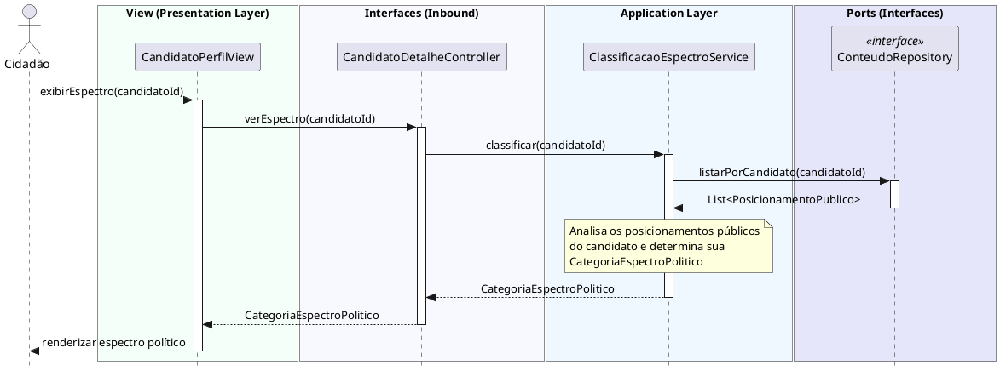

# Visualizar Espectro Político
[](https://editor.plantuml.com/uml/ZPJFYXf14CRl0_CEXRcuXuKSSXAHtJKX22uC2KdEPK-fHTgkINUFMVCwEUS5SlN5Kjqw_c4moKLccFv-N_Nt5Jw4Y3ws6riMuIkx1Zrk8CIT9VtrR7gVw5jBpj0pXO0hUhIySc38HVANnog5ik46NQomhjcjuCthiYWBD54y3APSOxt_AGF009z24fV5GbvWy9dfEmmhJq6X65aSp757_cu0hvxPnQadt9H5SpPG6hfQWL4gyaks2P71wQ4ioDMWw9F3B0sxH4C1XZEtaDRL2Vv-BI5-MNEaM_It5D6kQIekUh6MV3QPHc_x9ezDOzbSpAyE6fQX9zls32o6m4izRb3UXOQCyZ-It-hnR75yxhjKucE-HNUZT94vRlLSYlJQHSUcjfOFr4XWRM6NsUaLncFk49F9bKtg1kudEKeO0RtmWdqtuz1qqSpgkzmjRp7ICVUoo28LfuXKlAL_AWzXbaLMgF9uSnMRKqZ-blWKKrbqEaNa2ux0Sjfq3UnKvorC4YH65jvV3J5NoBZI-8psYXlTKAdQXTOgcbfDFOGJVH6zztcsHuSw2e84QAv0-hx_dLb1MGAdwO2W9crdmmuXjAZfgCTAF6CNPoMMjMavL9TShq8uL_0NvSNu5q4UYZWlmFy1kXeF2w3gl4OZy7an-GTweADUKx3xNpr2jq8Fgj2_e3y0)

---
## Codificação do Diagrama

