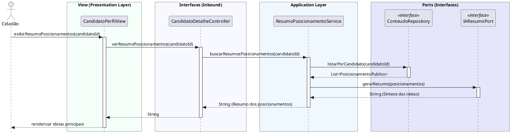

# Consultar Resumos de Interação na Mídia

---
## Codificação do Diagrama

```plantuml
@startuml
skinparam style strictuml
skinparam sequenceMessageAlign center
skinparam ParticipantPadding 40
skinparam ParticipantMinWidth 140
skinparam BoxPadding 20

actor "Cidadão" as User

box "View (Presentation Layer)" #MintCream
participant "CandidatoPerfilView" as View
end box

box "Interfaces (Inbound)" #GhostWhite
participant "CandidatoDetalheController" as Ctrl
end box

box "Application Layer" #AliceBlue
participant "ResumoPosicionamentoService" as Service
end box

box "Ports (Interfaces)" #Lavender
participant "ConteudoRepository" as Repo <<interface>>
participant "IAResumoPort" as IA <<interface>>
end box


User -> View : exibirResumoPosicionamentos(candidatoId)
activate View

View -> Ctrl : verResumoPosicionamentos(candidatoId)
activate Ctrl

Ctrl -> Service : buscarResumosPosicionamentos(candidatoId)
activate Service

Service -> Repo : listarPorCandidato(candidatoId)
activate Repo
Repo --> Service : List<PosicionamentoPublico>
deactivate Repo

Service -> IA : gerarResumo(posicionamentos)
activate IA
IA --> Service : String (Síntese das ideias)
deactivate IA

Service --> Ctrl : String (Resumo dos posicionamentos)
deactivate Service

Ctrl --> View : String
deactivate Ctrl

View --> User : renderizar ideias principais
deactivate View

@enduml
```
