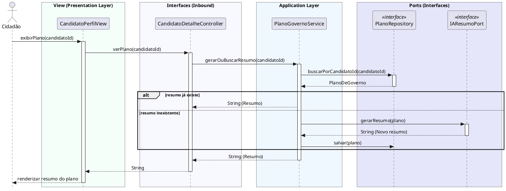

# Visualizar Resumo de Plano de Governo
[](https://editor.plantuml.com/uml/VLHBRjim4DqBu1q8TsCl0gH5LqPWH7Q0G43I2WdQhCVYn6PBaof9gNPlK_GekLY7b6HB5Xmj1DcQzvatGzqw3zPNEyKIzrFg4YpikFC7XNItiXYzmbyLwW8VqJdOOAhaHlC2jKVRByk9L1Qo1Erp44Bg3VzyVQ7WKUeNAVoMVnoMBCs-mtwY5oo1mXlB9oifGBpzCnCEZdzpGPWbQxFda-yIV_DfRj6H8V3IQFu01xIp2Vz0Advb4NOiAK_Qn0PQ4A4tETfNgG9590uFB44jE54V5RBGw2iKwFWqqsjJQH78xxV6-PUjz7Y9_Guzg2skZFRMA8KsYgoyLMEHj2oLB7h-IO62Bd2fgdE1N84szwP6gyqpsfgg8dFxF2RFZVNHVDT8yFy0DTM59CVaJrWQ9odvGoGEF_dDZUpmYyKPA4kVq5Kx4uGY8alFwtkUM18coAyMCN0-vxYNQscZyhJeqil4B8vVrk2n7GrB8eAG8KL2KWRlmfgmMHBB2TP6HCWDMh1VgsNb2h2D-qianrnPqk69AeOov-j8G8slJk1BH072aWYy6fY9FTnXErEM23p348dot4QR_CVRtn2P2vl7wJgQEkNoJEUOpj2qQOmye7BOuQLkq7f4i0Y3QxDfCoc3jLbJTpILfSqVL3rifDFzOchJohNONai1FH9kutIWQh17LTgQGUplTDWJw0si6VnfrHhOeBhRaMQrg3HkvvpiX-CX_u3jWXE6HsC3UBUPjrHE7yx_)

---
## Codificação do Diagrama

