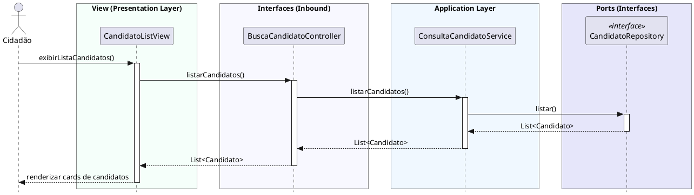

# Buscar Candidatos
[](https://editor.plantuml.com/uml/XPFDRben48NtblmE8xeXYqXjrLM4K0ABAXAHKAiswy6UmgZ6lhLzAVHr-YXziOuDbyjFaswGqSntpimPtVkKCUPsxRHAtzat674DAUySoMzaSrMY7orvGq-K4YxfmV7IWo6VAPwspKMK3JVeynojPR-43szVQ7XY_ymsh-3TUSiaR3lslHIqGfD3XC6KBTe_lyC0CC6NL8orMeGj3Buo_OJXF5AIWJ1py3337SMR0RmHbpoDX6kjcjvRrD1R4SnXnYaNWIfR7bgHjo32H_t7ikOtD9HW-EWNeVMsI7zSXPIVLvpfGdlI9eD7WsdmEGRdA5QBQOxkskAXQHoRazb5Nq8sD77jfRm8fjRbtk4pnOsqLld3-zfX7cAkytUxb1Lck96-4kM_m_b4JKWiyU-gUFaBen5t6kFncOzMvInmEwuvmXtGbXSSIyBzi6buKq_A6ynq25oh2WXOqX7G5II-mEmJrAhs2dDO-N_OCHcjEaBWkb97dlMNYbQrVdlcKlOP7Kqa0aiNq8b3lzDhsCbi-wtw35_3kYJswGbJyx-3M8_Alp22mMWJM997bygPH7U0Uq7ac_yB)

---
## Codificação do Diagrama

