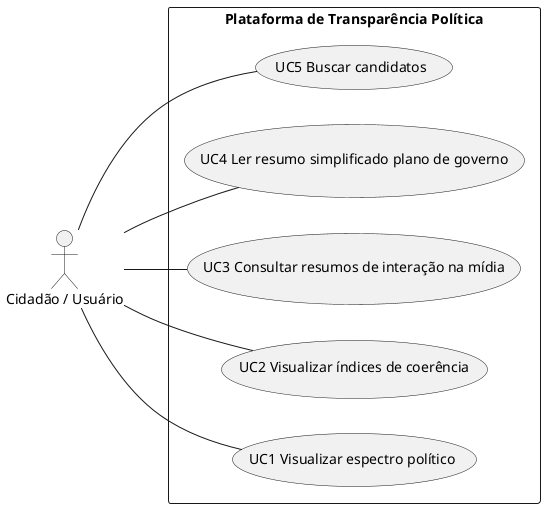

# Diagrama de Casos de Usos

---

# Descrição casos de uso

### UC1 - Visualizar Espectro Político:
- Atores: Cidadãos Brasileiros.
- Sumário: O sistema identifica e posiciona o candidato em um mapa ideológico para contextualizar suas propostas.
- Pré-Condição: O usuário deve ter selecionado um candidato.
- Pós-Condição: O usuário visualiza a inclinação política do candidato.
### UC2 - Visualizar índices de coerência:
- Atores
### Especificação UC3:
[imagem]
### Especificação UC4:
[imagem]
### Especificação UC5:
[imagem]

