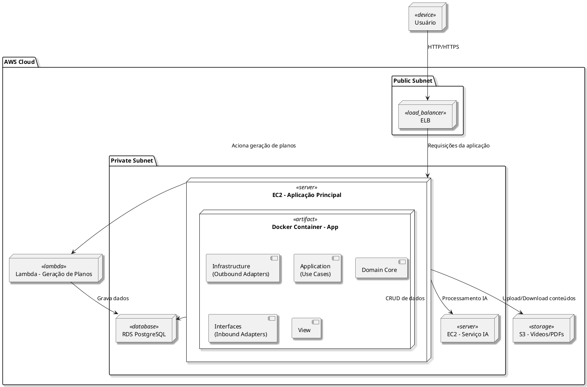

# Diagrama de Implantação
[](https://editor.plantuml.com/uml/bLHDRzD04BrRydyOvL8uH1L5NA8gQd1eYLI943VXWeGczYIiQk-QtNMAXF9ZAWuzSUJ2rN-CsTquNsgBy25PpywRUJDlnXV6ehPrMSIHkHMoGeqbcA-OgpiXbs1rJVitcZABSbaG_8WZW8cgPPueBKd3gpTnj8wZE3hfThimDNLphuK2VeaZgNA2Jclh01fsOCpvUKuhaL6_x-9vz0O_-9H2KgWw3m4gp6vnoJ6szev3E0u09p2kvuN88AtdacmmRX47Tpvri0H3g2CyWUMxwxVUY_-PNw4m_pB70cL6kjyFpkkzp5giqD8JgGykG-vWUZ9vSWPSVCNyi7beVYe7a9cei0YaahD1LJ4lxjxA4TgBi0qoLDajDpTHqg9mqhY8bSU7gn22THSBp6neFXmzcIeh9KbQw8paGgFXKSXihUcpVF6XjdEdF0noh2nfyxBpR03EvmgoGab6i_AGeA5_eOQgPFfSXgRd7KUIEN0bP3ZwIFuNjPcWkoEFzUvr_RW-AJTVD0yAHeDMbT5WJvHZr6IOmbWPkzIKVhps46VYwKUBSsx58uFLvZ2m94qy0hoI1XPA8-G8it4I74E2QopdREt25UdDtB1vp5EhZ4-tSU1vzeSsNq2dhnavQtxbfCpfU7WP86pbYYmdN7f-kzs-BEhlpCM8acLTiB2E6K5MeEQ3trU_tTrktszH3zxVt8nFtKyQHyxYRy8ezs12tsfXkDRcDnbN7Ex6t-NSE6umtEWUBuLYjGsMhA5JuS39jRO7oMGwT4t87Rk3Uowi1zFARVRfKDr9T-2Hu25g_XpxRlhMWq76mujEYrr_Az_VyD5g5TZclzAumZPx75sGpFah-nS0)

---
## Descrição

O diagrama representa a arquitetura de implantação do sistema de democratização da informação política na AWS:

- O **usuário** acessa a aplicação via **ELB (Elastic Load Balancer)**, que distribui requisições para a **EC2 principal** na **subnet privada**.
- Na EC2, a aplicação roda em **containers Docker**:
  - **Spring Boot API** com seus componentes (autenticação, lógica de negócios, etc.).
- A aplicação interage com o **RDS PostgreSQL** para persistência de dados e com o **S3** para armazenamento de vídeos e PDFs.
- A **EC2 principal** aciona a **Lambda Function** quando é necessário gerar planos de governo, que acessa IA e banco de dados.
- A separação entre **subnets públicas e privadas** garante segurança, mantendo recursos sensíveis isolados da internet.

---
## Codificação do Diagrama

