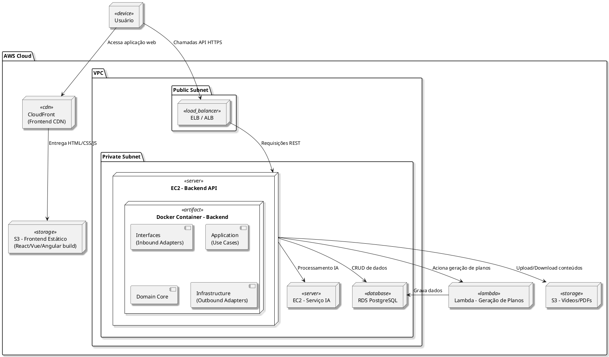
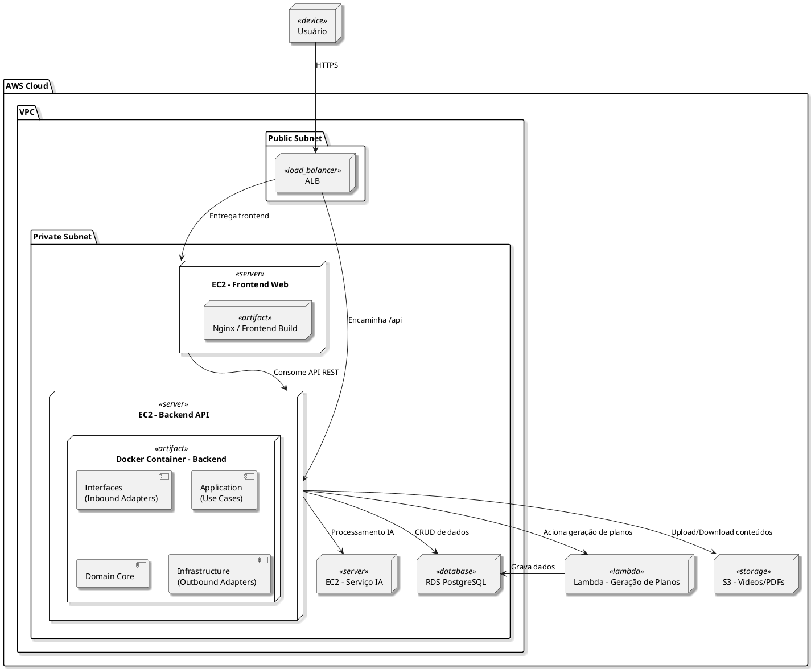
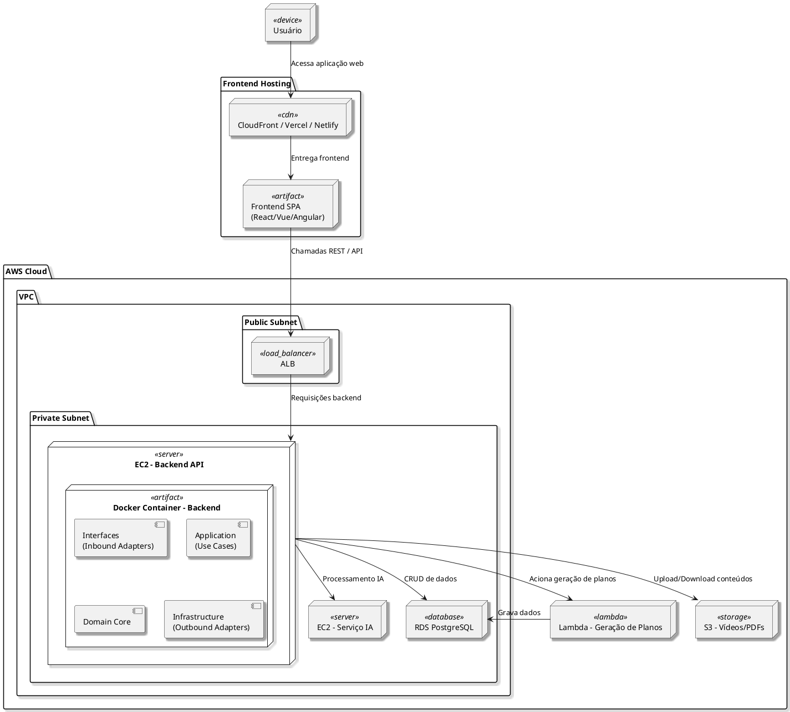

# Diagrama de Implantação
### CDN + S3

### EC2s Separadas

### Hospedagem em outro ambiente

---
## Descrição

O diagrama representa a arquitetura de implantação do sistema de democratização da informação política na AWS:

- O **usuário** acessa a aplicação via **ELB (Elastic Load Balancer)**, que distribui requisições para a **EC2 principal** na **subnet privada**.
- Na EC2, a aplicação roda em **containers Docker**:
  - **Spring Boot API** com seus componentes (autenticação, lógica de negócios, etc.).
- A aplicação interage com o **RDS PostgreSQL** para persistência de dados e com o **S3** para armazenamento de vídeos e PDFs.
- A **EC2 principal** aciona a **Lambda Function** quando é necessário gerar planos de governo, que acessa IA e banco de dados.
- A separação entre **subnets públicas e privadas** garante segurança, mantendo recursos sensíveis isolados da internet.

---
## Codificação do Diagrama
### CDN + S3

### EC2s Separadas

### Hospedagem separada

