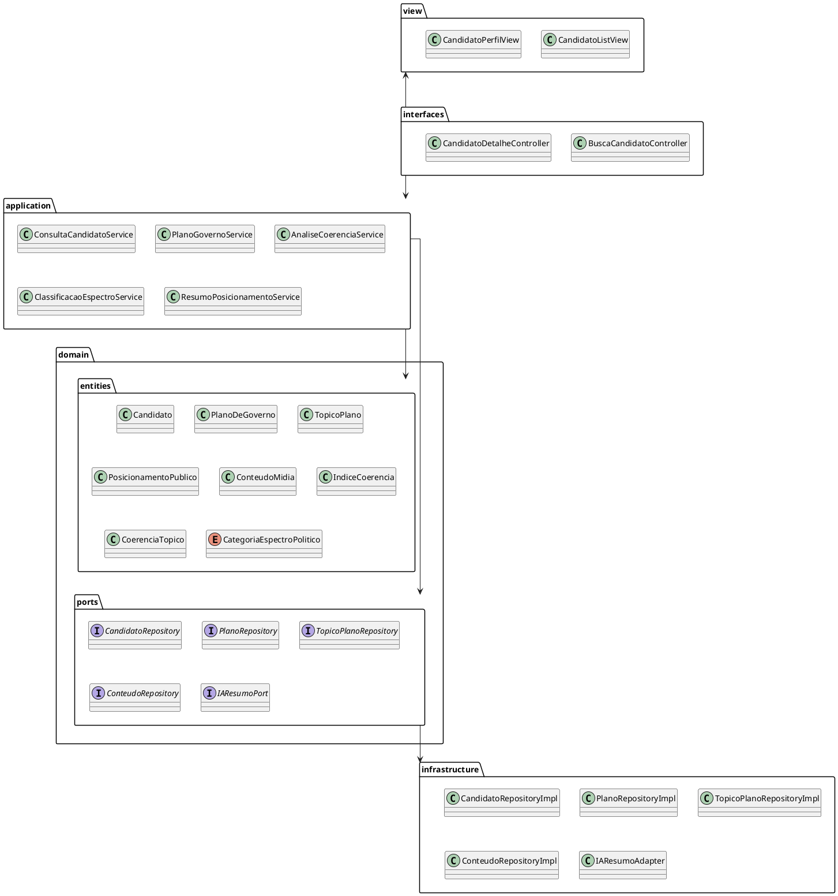

# Diagrama de Pacotes

[](https://editor.plantuml.com/uml/TLJRYjmm37qFv1_CllHf-WbbfpEb3BGGjik-b3veRSsCMCSojZBBKlf3_Ot-M9tCnKwo8H28pf6EZcJdFWe4wLfRL_qJNyXv2D0gImxbpQFY84UkAs6lXDKpYt2h30NKGkpAb7W4mw_a3ceFDc9VpuD-WGEgknFXwvtwNLTAMuXHRS0PCY3yZQ8y9N2ED1ZsPC_Odw8KEKa8Q8n3mPHuoVpSHGstz0qx2MmjXiouWLiKi4SiEOD88GFUMzBGcvpefApOMSbIFp2SI6DcD1OSV-KJ1ZS7rmuinQID0Pqcc14s_PlsILm3Vua-JJhCopnWx5fkE99EBKABhcXaQiPm2-G-9Wu9pGPtCp9niCMBXnn_P4-Q1xGWZvfekkSqE1xDIx0p_9qCGGxlagZEOoZvbz1Ph0VGTMrgK_30WU0wauPjijCp5lpwT7YpsTl1oOOVqAVUXSFRc30ON0AB6InHhfQNyDtwkhuWy-x9xGD42PsMBk3IidBjNUljP7LBuBkzZodptiVujVUr0I_5pVcWjkZHcNz_-zt5j3C9g98f5enrbQ-jMdL-jVgaJiFLBkCfM5oxkYe-r2hzMrpFc9pbkfe4rEhdaOn1z-kSaLE6up2fEaFBhomwNablzpvPJV_D_m00)

---
## Diagrama de Pacotes

O diagrama de pacotes mostra a **organização do código por pacotes**, evidenciando **dependências entre eles**:

- **view** - contém as clsses referentes a Interface Gráfica do Usuário (GUI).
- **interfaces (Inbound Adapters)** – contém os controllers que recebem as requisições do usuário.  
- **application (Use Cases)** – implementa os casos de uso, orquestrando a lógica de negócio.  
- **domain.entities** – contém as entidades do domínio que representam o core da aplicação.  
- **domain.ports** – interfaces que definem contratos que serão implementados pela infraestrutura.  
- **infrastructure** – implementações técnicas de repositórios e integrações externas (adapters).
  

---

## Codificação do Diagrama

