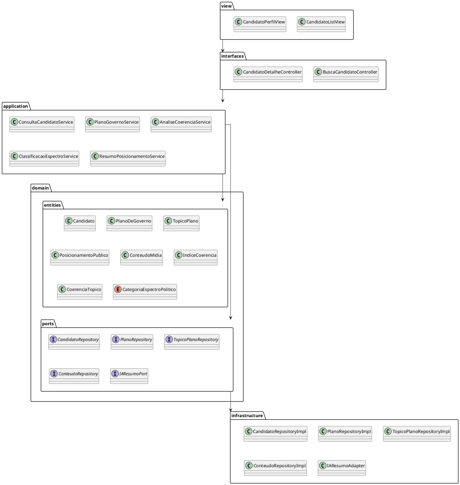

# Diagrama de Pacotes

[](https://editor.plantuml.com/uml/TLJRYjim47qFv1_4llGf_OIoQL9Ae0MpNVQbz65McYJ3oXeXZRCifJ_Kt-YFLN8kakqr0HFFEJDdpeoi-oWGf6ljSf5_yOMSXm2jikHGtZmg3dBavKBOAs7rp2BSAaC1jH2xEYKUmV0hkOFQWusOwtdGBt10TNSYVBrJlvSBfIt4g3RW31aG_aPHdX8uHHeCUx9dx4zLYfma13J6lc1Al6H-xgA6M_g6dGIs5aDXtC0j2jWZrfnUf981xorfo2P7EYahTbQAr0yC9z9O68q5nr_vXC5DmRK3Ip5fOq2d2IQ4JNxIFebhu2_Hfqc7QPa7Z5tB3KVIgKLeqLMDZCqORe7SnyGXeSdWRaP63hPuyL3YZ-n9SuzMv44JJVUS1iU3UGbsXh-J8IZXNHBLPGmr_n8wYsK0NTUcDWKF70YkCsdO9ZkPCUFNfyDRpDuEJZ7yW3xrBXpUXeJUu1nOpM2EShKyX-_Mr_K5cNPFRXyWIkYqT07dbbLgxrflHwkR0z_jVKYPzZx4hxsl3NYflfmFQeiUdVdtD-ykffr9G9LCiM3CX7m7gDNgKvb32fV_FLHzTSj5zQ9MwMfncJ4woil5AA1MFuza3BfVvuoIqf-6KTK9MhyLqU56ifdxv3HTc_y1)

---
## Diagrama de Pacotes

O diagrama de pacotes mostra a **organização do código por pacotes**, evidenciando **dependências entre eles**:

- **view** - contém as clsses referentes a Interface Gráfica do Usuário (GUI).
- **interfaces (Inbound Adapters)** – contém os controllers que recebem as requisições do usuário.  
- **application (Use Cases)** – implementa os casos de uso, orquestrando a lógica de negócio.  
- **domain.entities** – contém as entidades do domínio que representam o core da aplicação.  
- **domain.ports** – interfaces que definem contratos que serão implementados pela infraestrutura.  
- **infrastructure** – implementações técnicas de repositórios e integrações externas (adapters).
  

---

## Codificação do Diagrama

