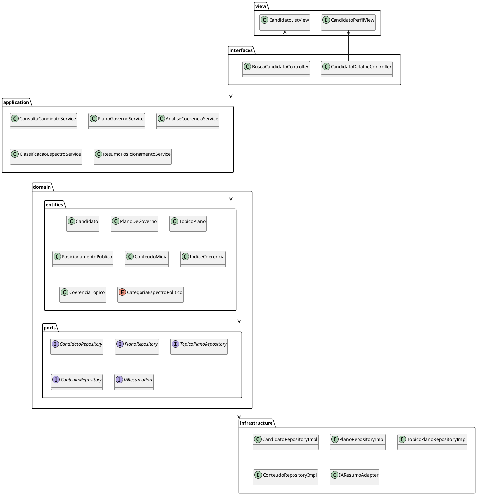

# Diagrama de Pacotes

[](https://editor.plantuml.com/uml/TLJRYXin37qFv1_CllGf_OIoQL9Ae8MmNVQbz45hAubOZsLiJPQbz8Vw6_snQdApPsQ7G61yZgHpPCdtMI19s_ZvhFlb5meH4ZJ6Kq1vYsWuoO7dC-5eXCqpYt1Z72MqGXpga7m0nwyKzcO7FcENBu9zWJsQkoFXwvtvFPyPwo5diuBWo87mDyhofE0OsMBQaJzZVwfK54GHi9XF2JNm4lcvpHPkuIiEajXxJ8Ln0zSeu0zOSqv5gZ8GeoSBdSb17OtAhPTIwWUc8raiZAs7m5_vY2cCmMK0JrbhOy9W2KQ4LVTFEorkWR_ag9rEupGFcDk6jvp9gaHeC5H2XcOSDq3Xet98QDIucv61WpLUF9JpHuva-OHMv9w8RVkiZUDUlmHRnz_94PJZZHQrfGqr_t9qBjO16Df6PGhkEH5SUx9bhtOwneJVgCDRpDu6fnX-mAZQXTDRdt0oE0LMFPYYN2rFuPlbzVgIZDLJs2N8abehRSAfoogvDqtqWwkR0j_LtgUCjVVng_QbWoZLvaojdrcqSV7flOsVNiTXJFqMV31hZ1ZSlx_TZ6IT3Kbej7aic3iXvO4m2qrIBV9yLdsOXRvMeMCCjcC-6noOnSy3EOVXrpcYX9m6R91rXDPVfMZ_aZlTzsfAN-B_)

---
## Diagrama de Pacotes

O diagrama de pacotes mostra a **organização do código por pacotes**, evidenciando **dependências entre eles**:

- **view** - contém as clsses referentes a Interface Gráfica do Usuário (GUI).
- **interfaces (Inbound Adapters)** – contém os controllers que recebem as requisições do usuário.  
- **application (Use Cases)** – implementa os casos de uso, orquestrando a lógica de negócio.  
- **domain.entities** – contém as entidades do domínio que representam o core da aplicação.  
- **domain.ports** – interfaces que definem contratos que serão implementados pela infraestrutura.  
- **infrastructure** – implementações técnicas de repositórios e integrações externas (adapters).
  

---

## Codificação do Diagrama

