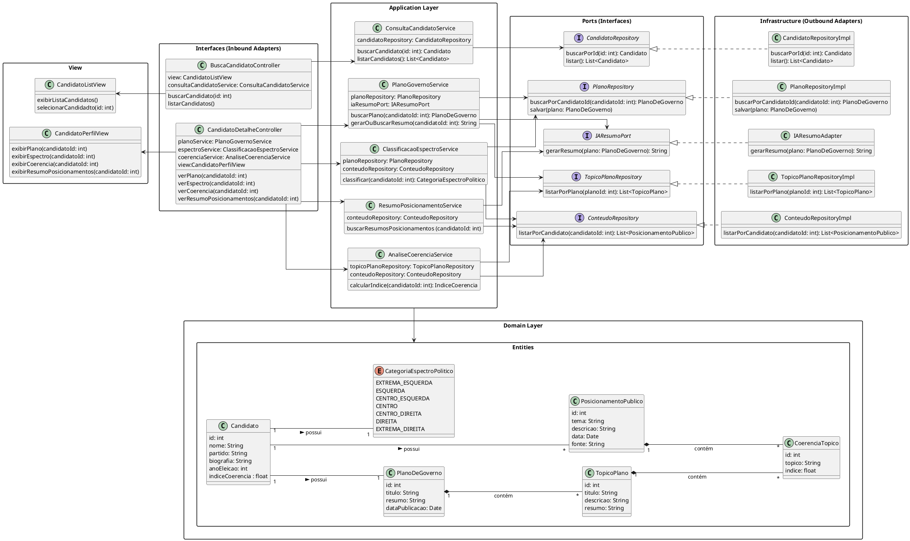

# Diagrama de Classe de Implementação

![](https://www.plantuml.com/plantuml/png/jLXTRkCs47xdAOYyD5aW2_Gr289rRQCGi6rS9otwjc2aiKCiHGeabJROvhK7w2rwZjwa9ocfq2EA9fKiWWO8R7F-v_iu6lk3iKpRlXN4VEQoOvgrj6FrPxQ76_ieW6geBPDx0P62u1BiOmTKQNklY82TfLPHpVVtbZRSct0b2GcEwCal77uxeLy8gGKpXYwPR7Z3hFh8ZVKo9wBX3txdTrnx0KCrStg6SWC2QkUTwI1kh3hbpGNbqZvhFP7X9Gcr0RtZ8Xji8vXKf_L1imhE4gsrwLnT-cN5fG8DikRiHSqjcBvL6sNuK54BqjUQMc5LJr57AsbTGQm6GqyhUQTwsT15mpftQiwYLd_Nctfiv599gvKGe7qJ7bmpBex18BHMqlGY0k06z0ElmIaN98JGEnz9eo32H7WmzGJDfoCghC0oSG_J33kF30OVSFfUFO36Gq8Xm3AcwFto7QzPpTHwAlMb1N1GVo6PIn2MYI2q9yCVuaHG98sNXQWbCORAorzDYuGIYwuJhchhREX7zWXwf44HDzzaTBo5piMqIZyYA-B36OmZ_GpSJkovTOb7LuX_3bC4FivdCpqWbBD3cxIzeDLY_8Hv5Y0ApbOGmXAw1ytqTJ_SbT3zdDcDrLpkCVSCSp1_gpfUgqrQnMtkUBXl5lfc2i3H6V5GYReNJ5UoSO5oEJvBC2LCDdijPZl-XYmnbCwbk6GMzafpTiXYemIthYzZihaRWBc-EXFgYJ12Qf8RHL--KYlLCXxV9fIifNKvWyazrNoAuMOGAbKBI1tQCMrveyQ3Ewxsckqu6u-OL6i1hdigkE1JJEa5tGd5BBOhuVCalCko5r4yxLiHVNRviar_vmV74735BA3ZYA_pNXimjNOkoe7GvHI4vz29SsXPoJNc73AbEm_xSHHibgyWzJySeKreRzHKa7rRPgdtjVxrThl-OV5fVVFJp-ljQa7e-6wv_l5sU_qfFK31gjgkgrjtZc-2DvGyaQS92_rGSsp5HtvumFF3vzomfbzm2YfTDNEJkZ2VqJrEWfnhjAcQrqnQmyI3YzZvurHwDecAt4jYXwnzx44s-CA8ePBHDgq5nqJU9PQJ5eEkS_nDWyHF8-z-3ngVA_dIHmQdQzvECsDrNzjU0pszxcrvrylGe6exuTVTbxb0osn81atg_VyZGpg4qj1VpmLqcl80FRwP2XW3QH2m-ceY-Fzlw66x__VFlsYquX5INEtFpwzc5lNines6sILxtcH-uvwtBMxVysPp2uBlMTIdeM_312Mar1JlCh_n9jr0vOIDHRru4XILybiXoRTcpcJ68hkfpG6NBJDlC1yb0zMRJDAkUhm7V0UafmEJaDoZyVAFz-zBmt80ALNEpJqoGf2gboSMIOf5Y_mu8d6XWs8wKtpnOKdL80R2ctlUcQXmUlBjYUkQVvbPQYwe2snwJg-obicOcbT_TvBVyc8haZZqjk-2yTW-R-AN_N_-RidOy4GztVL6armMhxJrZHr-BDeUsah8ySzMbyvDQGoJvAS3D2YFDXTq-Ag1GId9VQi_xxlpg-Wh2Fa0ikbRyHy0)

---
### Descrição 

O sistema é organizado em camadas:

#### 1. Interfaces (Inbound Adapters)

  - Controllers expõem endpoints para busca de candidatos e detalhes de seus planos, espectro político e coerência.

  - Exemplo: BuscaCandidatoController delega chamadas para ConsultaCandidatoService.

#### 2. Application Layer

  - Contém services que implementam a lógica de aplicação, coordenando a comunicação entre os repositórios, adaptadores e entidades de domínio.

  - Exemplo: PlanoGovernoService busca planos e gera resumos via IA (IAResumoPort).

#### 3. Domain Layer

  - Define as entidades centrais (Candidato, PlanoDeGoverno, TopicoPlano, etc.) e enums (CategoriaEspectroPolitico), representando o núcleo do negócio.

  - As entidades mantêm relacionamentos importantes, como cada candidato possuindo um plano de governo, índice de coerência e categoria política.

#### 4. Ports (Interfaces)

  - Interfaces que abstraem dependências externas, como repositórios de dados e adaptadores de IA.

  - Permitem que a Application Layer não dependa diretamente da implementação de infraestrutura.

#### 5. Infrastructure (Outbound Adapters)

  - Implementações concretas das interfaces de portas (RepositoryImpl, IAResumoAdapter) que interagem com bancos de dados ou serviços externos.

#### 6. View

 - Classes que representam a interface gráfica do usuário

---

## Codificação do Diagrama

