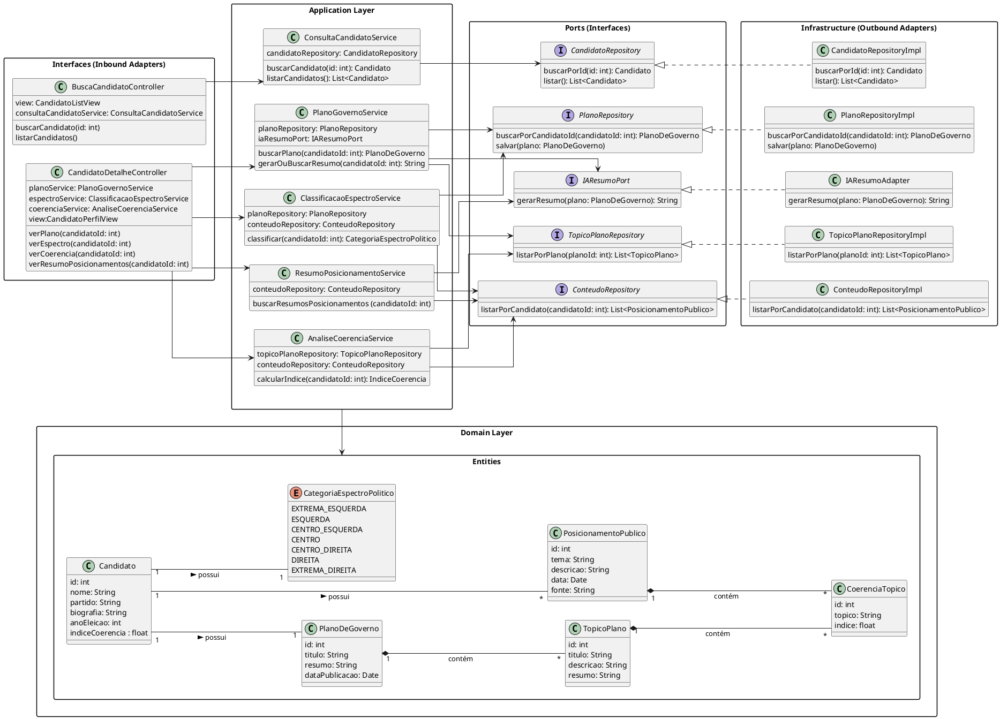

# Diagrama de Classe de Implementação

![](https://www.plantuml.com/plantuml/png/jLTTRXit47xdAGP-gHmW0Veg14PKIIWMI6jLTek-1VJkI2R29HSaruMH-hK7w2rwZjwa9ocvMSrIBBbnO1I68UqCvsU--JWxUcSTDwvl9RCVXUguuIrqlFx8ZtZZ7YM2mTfnTPGO7P12eNli4BHnzvf9F3Xm6emutZjeH30HMZ76HazmKIc7vi1hjB2er9tkLGEhXdTUQYylu1DZjUJMmdUzhVcQgqOqtEcrLiveAT7u4_0WyBSbaFAziEuNBs9GQsLxwIQx6pGFeaP_kA1X3Ev294EAXMYM89IxP22zuqXZ5vViwPGVIJVekBp7ymmxoTKKV1UUljSFQ4Z806s7jJDHYi6lE8YQrrnlpxMXD3IeQi7f_4fndo2k4yK83-Mtyt0BEU3ZLMY6P1RrILrHjLutHYsfALH1lqVRjtgdhQY5Lhn5vK7BdFKWFaMKM7MTz5K7fi1x_eXcea6nRm5aShp7piTqsZmIAsBXJ8-ZyxbsBo5mwos9hgZ_kPvIu-DyTkS21eAVO39k2TLgUg8y2oqQdMrm3ClWY8QRwtwuAoFwERCRPuGwKkuPvb3-JdUYrhkqYjkSUBXl3llcl06HZF2lkQnxoKsb6Xyeb-Dd3QL4oPQlHGdn5sH9eKmknJLtUDH6y5CMEos5yxXCoUPk0ENwx4mW465ggKrk57pvIcrqoqLycqYpLSxdZ3P8qr4MKXnl1WEbMoJgGCUD4usU17T27mq_23w9kD9RYHuzFReGvps59HoavexWIlXy5jvdsSiedWbGHCy-NxxhxyBW609kk4Do7FDrrck3jZRUHJaGkJnlmkVGYNDiUSarvJnc2eVGzlz68R121Qd_829t9tWZK57rRPcbmTVsrzlzzeVLX-tDJpzlzviLW-dRUllZxVxwGoeWnQRQRwjRBn-_a3VIFFc_c8LXg7csqYj_VC6BqtDkMCCdceBQLCtSf2xCPt9Fao3dccogvZcJrdBvu2DsGPngBy-Y4lVIs6FMEptEz-2B8ewLJBP9BJGc2Ywf72ecTPtZRneaVXi5zqSqz5x9bqviJ0PGfGw6MsVwslK6ON7Tk_Akbw51rNRI9m1VvWAKsP0CcjJx_qU6T0YbeR-U2-IKU91wV34LA0RHOEpLLnCX_7y3f-t-dp_-X6Z5Owoushz-VJMpgEStRZBCBTdp9lCRzxnjSVkUDvjR43ncCKu3RiC4PQm4Id2PttWJDEXmmiRYkNWIb0uLja9MWAPiCckHszJAZIkKMJOeHycqwaKcAQgXtqD_XqwV3qp6Sg_6jx-_ULCQbaEJqiEvkSUc5gJ7onEBKR69HNuSiRZGuM0wKqBnuv9gK0w4j_UYir7XSF7jXKSjVCmiDKlmWMqlu2fhcOof-UElBWfRNcJ54eV1zjLeFC4NJCAo__TVBMCaJewdkzvaailYkROUsM7jX_s8Ax3SB-pNVUS9EVqSOEzGDNqh_mK0)

---
### Descrição 

O sistema é organizado em camadas:

#### 1. Interfaces (Inbound Adapters)

  - Controllers expõem endpoints para busca de candidatos e detalhes de seus planos, espectro político e coerência.

  - Exemplo: BuscaCandidatoController delega chamadas para ConsultaCandidatoService.

#### 2. Application Layer

  - Contém services que implementam a lógica de aplicação, coordenando a comunicação entre os repositórios, adaptadores e entidades de domínio.

  - Exemplo: PlanoGovernoService busca planos e gera resumos via IA (IAResumoPort).

#### 3. Domain Layer

  - Define as entidades centrais (Candidato, PlanoDeGoverno, TopicoPlano, etc.) e enums (CategoriaEspectroPolitico), representando o núcleo do negócio.

  - As entidades mantêm relacionamentos importantes, como cada candidato possuindo um plano de governo, índice de coerência e categoria política.

#### 4. Ports (Interfaces)

  - Interfaces que abstraem dependências externas, como repositórios de dados e adaptadores de IA.

  - Permitem que a Application Layer não dependa diretamente da implementação de infraestrutura.

#### 5. Infrastructure (Outbound Adapters)

  - Implementações concretas das interfaces de portas (RepositoryImpl, IAResumoAdapter) que interagem com bancos de dados ou serviços externos.

---

## Codificação do Diagrama

