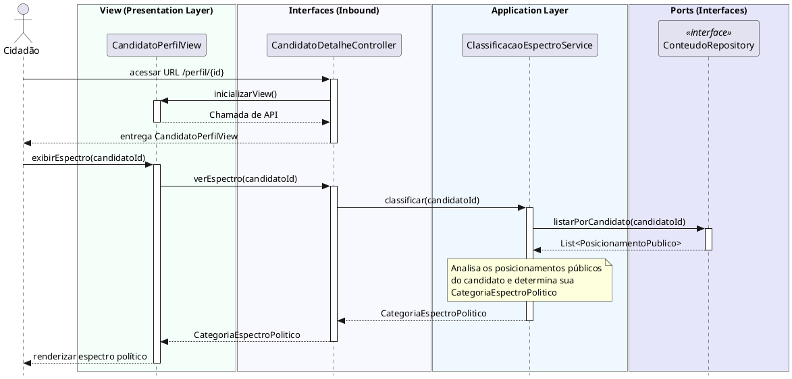

# Visualizar Espectro Político
[](https://editor.plantuml.com/uml/ZLInRjim4Dq5w1yExb1dCDAXan4OKPqq4E34WjiaNS_InIPAaof9kKcBJXtw8Ptx0rtzOpqoaYB5DTf582M-z-xUFUhKEZIksiWuiX-5Aj7W1gnxaCHF8_AzJ_If8fNJ9LcBAqgaM2d8IJaotMCPaufSbAXSXaKXr0fUlugZECBSQGE3gIYmsFtK0q0BrzQ3usYfxs5m8-Wp33D3badH2QrWXWzaZWRmub8eDpM4cpWgdmIO3LN1X4vdPEw4z1I1s2_YY5G1JDqgfBxOEyp9mZ1LIrsfmfDVhBLrjslXw13x6JcKQvfgvOoMaamGcJeZzqMIifGYxzJF2cnMJczajISWqLfnnyTprEUsf9pvtv7Pyl4WKQ_tLJ9jNEYYwSWtCiCjd_EMzbMuRAeAlQ1IMy5JU0ZSVWid9wAXc4nwCYzXD1h1rVmcWVJg_VaYsVtOVP_pEfscoSn_Z2C_FnXDWXCm1b-7HGFNYnaSbs4Ynrz5yIqCNspHKUrP70K48yFGno0KLujIV47ZtmoFEf37MOQ3eoUjwHetM20K14cMnb51pm2D1aD2cMFWM1bQ8VmbD3ryK-EZ0szdrn_cC5-a5-aLzpticd6Mm4rwVdlKTwFkYUx5KfXcgiEyKKsB_UwQ_jhsjlHFv7ChwwmmE6zZPGw1ss35KODZYX29CKZX_mqSiTQfGpGUu3a2SDGhOiOa9na7BkURW1isNsVLaY-2dlJSRYYKvetclfzgInH7mY9e2sMFYFUxtu7BCfU6jZeW3WJdUICKWgsGtM6DbJO26pipBGNV3VqOTg_QCw6JiCF8JlaT8zkyrG7uFu9cZ6t0wxIQS9NzZG2gyUo2tFtQOsWYTCe8_cd_0G00)

---
## Codificação do Diagrama

