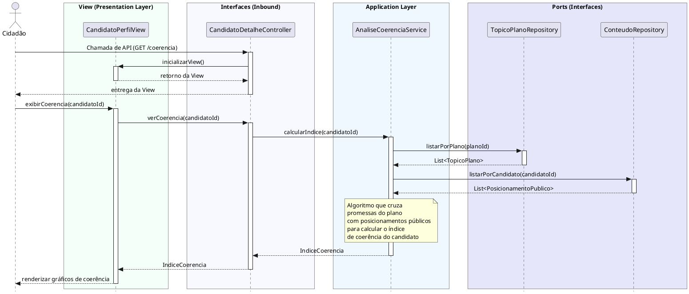

# Visualizar Índices de Coerência
[![](https://img.plantuml.biz/plantuml/svg/XLLDRzD04BrRydyOXGFf8U93d2fKrRYXM4eQAqqfryrwcgnOxvhrkhIzSk1t86v8_06k-MFCRcB7pWTSBCUUzzwysJVEUMcPiLKkmw3yB5J13CkXj8yIwMe4ttk5NofK7CTObco1aHGB1HoLHTCkIubKS54mPLEMPK8juCtB8mLZeMv5PfVmgbloJZ_KsDVq8WmOjzf0BnOPorO_TGzO2JUb4mw3kNw0taU1Nw6V6Yof8MQ5LZ1YZsXEUl2CL6niaELXK6orYOsfZ0YjJj7S2UaeFB6x2GDK6H1rev0uetUCOmdzHCrrfJ97VhdKfRrT2el7s2_GChd4M2jhj9Hel4XiZTmNYOf22jxgdnHeq1pVoMfN859CYf9uqT2n27QDvfugFVlcVbyWrSPw0xKPvs74xgdEJRCZCDE5u3gLJEaf5heKT0QFdjxzNB_TDKqciSeErTUlEZqzXy5W0CdLR3YDLjzNtoPqdyH9D8AB8KJnyFfw0ltuGpIEBYB_A4rE72GCtEd3uCpF4KuXNhASPGmoT3NGlnpEu0MlHtFY4oJkcSNDuCF00ud09-SKX28JDD0dPjoJVXko3eGl76mb3P8_fO5KrmKPxY1g4SBuTa-1mcbmmGvYwiRMCta_klaqWSaqkKokrkD8fnCta6Wyl9fDkaFOUC07CHUc2KIVrn5CidqxjQ76ppt-7xexl4tE2CsPv9La9Y4SnsFu9fTXK4E9PHid8g9CqtU9Skg3ro_SjKlIJbyBEkZqCoAQjwq4dtLctQROQwLEQhkPPfkFEUj6l4DpeB6KjeFJahES4g7JQauxVg35BM4OA4qFDHtITeYHN6WZRAw1lip0JVN4Q1-DpjqNkWIIzjCB0wvpA3gI9HIhFrwrz2lCcWC43QlV_X1TE-1sQFNBPSBnDURNM-nwwWnmcwPr3ff0TQorKj0io2R2_uBLuMiMSRDKnd-ytER2mgn-t3bJq6dzu6wU4up-ulu2)](https://editor.plantuml.com/uml/XLLDRzD04BrRydyOXGFf8U93d2fKrRYXM4eQAqqfryrwcgnOxvhrkhIzSk1t86v8_06k-MFCRcB7pWTSBCUUzzwysJVEUMcPiLKkmw3yB5J13CkXj8yIwMe4ttk5NofK7CTObco1aHGB1HoLHTCkIubKS54mPLEMPK8juCtB8mLZeMv5PfVmgbloJZ_KsDVq8WmOjzf0BnOPorO_TGzO2JUb4mw3kNw0taU1Nw6V6Yof8MQ5LZ1YZsXEUl2CL6niaELXK6orYOsfZ0YjJj7S2UaeFB6x2GDK6H1rev0uetUCOmdzHCrrfJ97VhdKfRrT2el7s2_GChd4M2jhj9Hel4XiZTmNYOf22jxgdnHeq1pVoMfN859CYf9uqT2n27QDvfugFVlcVbyWrSPw0xKPvs74xgdEJRCZCDE5u3gLJEaf5heKT0QFdjxzNB_TDKqciSeErTUlEZqzXy5W0CdLR3YDLjzNtoPqdyH9D8AB8KJnyFfw0ltuGpIEBYB_A4rE72GCtEd3uCpF4KuXNhASPGmoT3NGlnpEu0MlHtFY4oJkcSNDuCF00ud09-SKX28JDD0dPjoJVXko3eGl76mb3P8_fO5KrmKPxY1g4SBuTa-1mcbmmGvYwiRMCta_klaqWSaqkKokrkD8fnCta6Wyl9fDkaFOUC07CHUc2KIVrn5CidqxjQ76ppt-7xexl4tE2CsPv9La9Y4SnsFu9fTXK4E9PHid8g9CqtU9Skg3ro_SjKlIJbyBEkZqCoAQjwq4dtLctQROQwLEQhkPPfkFEUj6l4DpeB6KjeFJahES4g7JQauxVg35BM4OA4qFDHtITeYHN6WZRAw1lip0JVN4Q1-DpjqNkWIIzjCB0wvpA3gI9HIhFrwrz2lCcWC43QlV_X1TE-1sQFNBPSBnDURNM-nwwWnmcwPr3ff0TQorKj0io2R2_uBLuMiMSRDKnd-ytER2mgn-t3bJq6dzu6wU4up-ulu2)

---
## Codificação do Diagrama

