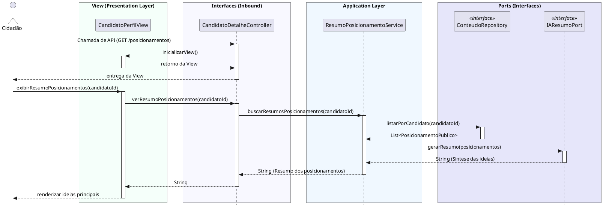

# Consultar Resumos de Interação na Mídia
[](https://editor.plantuml.com/uml/bLMzRjim4Du5w1qExb1bCFg3JaPWH57SL80T2tRITAN5gqrK9bMISfEk7VeWdViKVh4UQScHRATe5qEcxlkvuqVgmbYcRRKkmi1y4R9acgt1sCS2wLUB_EWLVgrGvZX1OzWIuq8i9UGeBUfsMKQa8XSbapPZd0kvX7UldocO27alk5t1csx9fNfei6_fHHYmt2eDlKHmnhU_L0-OWJlZXCDWeHwWzr7WDuWoZOOCCIkKX35xH7tMWnUaOXEDR1q6vPCsiJ79YT2g3FLdKJWAJ-mUmW0b1wBUAwIkqSyiHmDHAXUgajoHNw-KiVShOV4vzYkqh5XXegJLgYXGUv74wk9O92xBGkGj_wH0WyxnigWE1MPeghNAbA4L9TcQ6bTpr1kgzWhryx58fhJrJJGDkJx6R4DrRgBTBiWrLbpDi2GXseH7p-t-mlcvQ2Y6mmDS6ZVsjFM8D3wiRzbw2Vr-7zARsz4itlxS_fZISvgayHYkHX0de_by2b7o8Px4Lx5Voj8p1ma35mBe3_quOG39YgqPPy3HrK1qFRg5LsLdHERCnqbicCLw5yB0mud6nsW0GXA05U8xqsubQaDswV25_ITXZJGRgO2qTmKS3n2D266ywG6G6urBTXBJ6DjDvltuxjCKfhFqEhtP3IMRJTrOuidevdRQ7KNT0pw8XT2dGcAYlCbcoezRQvhRzxR1_wCv76eTH69QL2PdDPdvHxPzZCEW8I9E7y015C9TOXIo_MbxZiO1mi33-XrFOw8uxth9gWMTEJNixCYEe6E2CZs09UgcfUWlIKlZCA3whlQSxbcwuwBvzZUT38CK1GE2es0Esn9tw9Rqqzuq33i3m9M1OnCjejOqzt6i0xEZEfd2VThhv6f_LRZZKRk5ah3kx0jpCleN1A3FoHy0)

---
## Codificação do Diagrama

