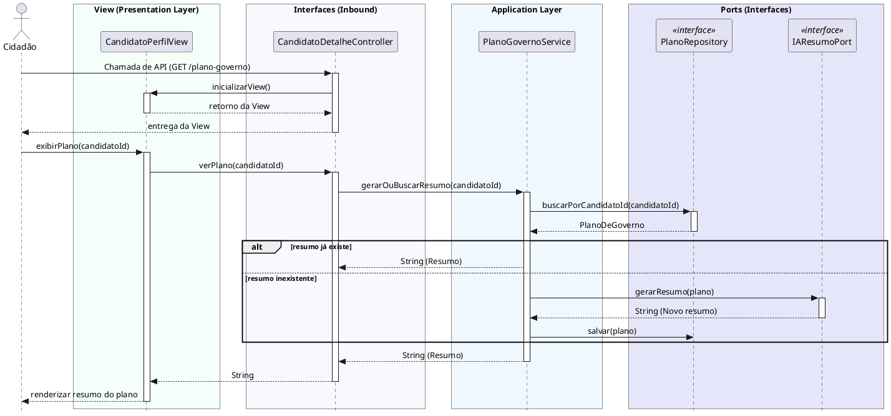

# Visualizar Resumo de Plano de Governo
[](https://editor.plantuml.com/uml/VLNBRXen5DsFDFzmHHU51Uf3NQ48PJ9GEXAF4IHDjsRc1jmQczg69jbsqU-e-YdyMAyz3ruXBD3WkUUSUu-FpRMnJDlDIeI1-S7bcccs0cEV1DAtvjdPA_ovGPdX28rX2um4NqZ8K5hKXsKfaVAChvcqASjpBXVmwVs5WX6NzpotI_XmN7AZ7YliHteH1YopIaCZvZdBT_zK0vY1E-E4ms2k7g7nbUClQAOQ3JN4B5SIXkm9TQi1RqZ5nXhPAWpMUsrYOp8dGgjIr0zSE0fFx1x206KEH5qh96xG1vQXWMOYvseZSqS-M2fZxvVSuYNs7becbXWhQRKI0hKNYQqMvoBHUYruTj0_AP3H6Tw8pQb0AfXK0xL5BTKCzPQgF7FvV4wUAcrzyzKWhlyXsrATS_ASV8fhPJWv_-I9tK-ukk8Lljiz0INH5CrcfPoGHoJHQVr1Js-XtMv3ChxjJwFTdztl2JqdSH8DeTU7AExFPXDenb-YKTIB_5AQj1ma3DpEGxlhFOGEn4ksOZc375qDD0VzMtYtTWEq5uKzBPyWlcKMI-F3m8E9n2Ud0rpI64pmPwRTIlCGKWJ25xRtiXh96Qc0b8k274yGbGXXVCiTe71gNB0NCLLZXI-VXtVV9Z2P9eDaN5YIJYVEb6ZK7zzEZeqePy17FkVQRrqpg-ANvEUZLCFKiv1Bhy9EJIipHiW5QgOdcvkDoPWkjlyIIHtCCAZmHELJrO6v9w3an7lm9I872GCFR1yrusVeONaeZjmjC4GYBEsSQnE-x_uwoumxka2VkgczBpEw2EaIQXQ3KGye35PuBWkqF2FekkINtfIU-3osYhgwgIGg5gZwU91ATwosgfGhiGSZEVIPS6cdOMBBTArAn-x8zbScF10usB0wo6NK2jYB-QtFIPbvxUyNTx0gut85lh4NZymrbTC_pty0)

---
## Codificação do Diagrama

