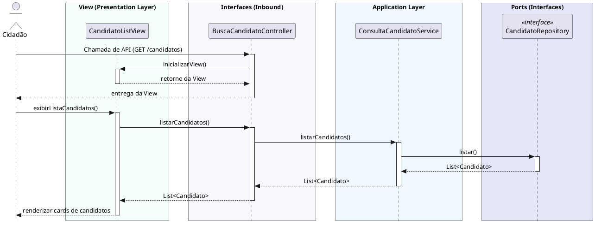

# Buscar Candidatos
[](https://editor.plantuml.com/uml/XLJBZjem5Dr7oZzSqKLX4VMXhX124pAKHW8I0TFfrYItO3NOgUrGPhPTz4FwAVnORPC70MQwGI6-vvnxZW_SIKM4AdQPwyWVbEL4a1r8zPIX_XGqkJh2dmMo16Se9TcWdz4DWmIPGd4-5cjIcj2SC1MJDALi0v_Ulp0me-oHfceB7zeZ8twei1_rWUkGH741dO2c93t-vHqW4Xwa4NQTDJz0vol5Nz2D1Kgz456KCvYI9nIz3hpHAYeGI7QkapVQcesmL1CgFgLI6G9BQnvS1raAchZc3utDxoH12TsGhNd1KaCzsNAf7hTKuGNtg909gGK2pfJWMOR2IWHAPDSIVfvdD3dRNVFha1CSPSKblIQKHQOQXIMAlHwrzENpjKBCXRBxLrwCXIdPwpaJvUrm5fXpINNyJvRSV8N1W5OSms5BvorudWVXV3LU-CS_nz-HVWw3q9_2_HZyOBnSHj0DllWp_zwth-AmPo2kOwuJlA4D1_eGRCcEf0HID3FGdOnNy2wfbf8zsmcw9mhBE5t78ZM3xK8VADDcI4QVYJ1lkkUGqoNRGQ_H5AXjCWvQzZIGuWMY4j4OksyVTDq4RiXDJBNOAPJFquTl4KIBS1BEJtd4YyWaui_6yrNKJg7qW0UwfiBqixbgUSD9vQMsaXc8U05p6LXPcF_1wbwvJeNGO5k82jcQDoUkOy-zbehnCwX5XgtCJg0pXSRJQx2ptUeRAZDy3LObKJUXl5LXVnAcEf0GaKfJmwPyDujnfo7w7_CV)

---
## Codificação do Diagrama

