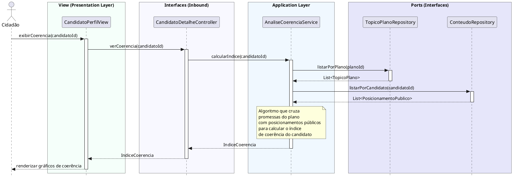

# Visualizar Índices de Coerência
[](https://editor.plantuml.com/uml/XLJBYXin4BmFw1yQv-8zB2GXfoKiwtKW6BmmvBNdjgPjYsYaYQHnxFsRa5iWFv2hVomjsVDQsybb65jTLTtLDRhp0LseIoqo_rMP2XsMuCDE4p-TaYT7zAqc8-c1lCSLJRHQ6P1a0hb-MSwaIgeAJSYnA9HPmPkN5meUb7bKHLZ3gs79lTqssDTy83AKmJeOJLM1nVwd7G5w-EoZiCWMTWkZBug-mpXtvBaX3CeQcEEEtDK8Nh1Ac3h2KcHLfyriQ0ec33OdjrGwKYJY-28oCWKmTQimYuCkKPA7ySmiR6sAIFv-RNruNAj0bzZVKK2zfgarmLcjoIMHQN3wL6HILLh9Nl-im4PBkjVrSu69GQqyyvBZjIZyI6x3bOdz-7uga5iNqW3DC766EMwuBhev4FXaAoLjhj7O3rHPhtW7kqGVVnvEdm_DGr9TdAjlZWOzYInk4Qvla-bm0xHL2-NQcSQoSN5MNAKOg0q6Egv8P0d5wEWcepVqV-Z1U94b24EFLZ5QefQrHZTZdAHB-DPQaJLGPkaSOI9U2tzQR7NoRbp5vv2aRs0FUZtePyuqRtjBk1LPGMSfJbffpEutqmRoqcJ3BGrepZIMyu8bvnHB_k9iNYyufcTQx0X5PYp_QNb9dOaJlR9EXT82NouWNVs472bdotZ9U63fv9x8f2sX6aXwgFP_agfFASHsWM1X_pijCRO3aYEn_nKp4VdQuGz1Z3qD3EpITCX16wZ1QBqK78BKHVXVi2PyXzmo9iN_1bpw_jGJzxvo-n_BE1GCMX_GDF6_OnZVqdy1)

---
## Codificação do Diagrama

