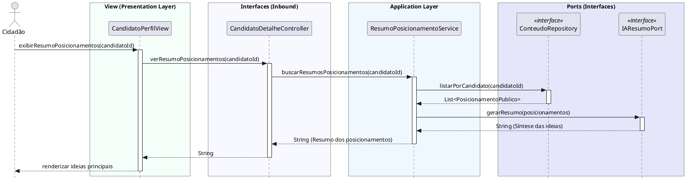

# Consultar Resumos de Interação na Mídia
[](https://editor.plantuml.com/uml/bPJFQXin4CRl0ht3u5wSGw0jFHaJuhXG5XnOOjgSvTN47YfBMqdhsdsTdliKUR6EPA-zQyVGNfRzC_FxPkQRrNs8oiTcRQG8tydMogirXBWpo5TFrSKd_D6WhV0HGr1Bd1XQMgZGHlJTi9AXL56jR2oLrcINyEdzbO17ii-aume-z4CUtBRD_SWVf51LT1u6Kz9Al_vs0r01leOaBCN2RM7mZV0d34kFWGjIaPo5cTgXlnd0ErQ9KuzgBKLzqcQQifg1qPNeNyWaH0Qd6odGQc3qKQ58ZRwe2WCC2xjmZTK9_cNbGdnUKSHhzCyObLdXrDdedJ7eiyWqUdCfCgbhGrMdVbRWGLVuO9fpWISCpTgLBl0RPzMQ6tTpz1kEpWg7-qkHqlcOcsWRIdtCr8RZqaJxNN3Ls6ZtX3KBiGcxp4wFC1vJYxYxEyih9crvFkQCOd8UtobBYcGctDxbsSC8S4iByczr68PLEzX2t-JDe8sAU71DYanWKXemapRuVvYzBrBaTCOSfiYaHHCgTO25VwGTFP2Y1J4pJsy4Xj8Vo1CwhierJ4gG8gVTzcgQCMBShwLi5hmmZWUiyGpGAu8D6S4IVTlIiEwtrDKl9b9mV5zxpeS4_w33-UiVjZKWQBQPD99AkHtnbDsHFddJ4lO5W7O1BeleW3hJtDjpMfWzgXVTEhbV20xDEpO2d_USVYb_g1PgpasBIw47Q3VgdXFuBFmB)

---
## Codificação do Diagrama

